<style TYPE="text/css">
code.has-jax {font: inherit; font-size: 100%; background: inherit; border: inherit;}
</style>
<script type="text/x-mathjax-config">
MathJax.Hub.Config({
    tex2jax: {
        inlineMath: [['$','$'], ['\\(','\\)']],
        skipTags: ['script', 'noscript', 'style', 'textarea', 'pre'] // removed 'code' entry
    }
});
MathJax.Hub.Queue(function() {
    var all = MathJax.Hub.getAllJax(), i;
    for(i = 0; i < all.length; i += 1) {
        all[i].SourceElement().parentNode.className += ' has-jax';
    }
});
</script>
<script type="text/javascript" src="https://cdnjs.cloudflare.com/ajax/libs/mathjax/2.7.4/MathJax.js?config=TeX-AMS_HTML-full"></script>

# Analysis of market risk measures for a portfolio of financial assets in Python

Risk management is the analysis of an investment's returns compared to its risk with the expectation that a greater degree of risk is supposed to be compensated by a higher expected return. Risk—or the probability of a loss—can be measured using statistical methods that are historical predictors of investment risk and volatility. Some common measurements of risk include standard deviation, Sharpe ratio, beta, value at risk (VaR), conditional value at risk (CVaR), etc.

In this notebook, we will be looking at the following measures that are most commonly used:

1. Standard deviation
2. Sharpe ratio
3. Value at Risk (VaR)
4. Conditional Value at Risk (CVaR) (also called expected shortfall)
5. Incremental VaR (IVaR)
6. Marginal VaR (MVaR)

First, let's load in the necessary libraries and construct the portfolio at hand. We are interested in the performance of blue chip big tech stocks, so the focus will be on a portfolio of big tech stocks. For parsimonious analysis, the number of stocks to keep in the portfolio will be restricted to 4.


```python
#import necessary libraries
import random
import pandas as pd
from pandas_datareader import data as pdr
import fix_yahoo_finance as yf
import numpy as np
import datetime as dt
import matplotlib.pyplot as plt
import matplotlib.mlab as mlab
import scipy
from scipy.stats import norm, t
```

**Data Generation Process:**


```python
# Import data
def getData(stocks, start, end):
    stockData = pdr.get_data_yahoo(stocks, start=start, end=end)
    stockData = stockData['Adj Close']
    returns = stockData.pct_change()
    meanReturns = returns.mean()
    covMatrix = returns.cov()
    return returns, meanReturns, covMatrix
# Portfolio Performance
def portfolioPerformance(weights, meanReturns, covMatrix):
    returns = np.sum(meanReturns*weights)
    std = np.sqrt(np.dot(weights.T, np.dot(covMatrix, weights)))
    return returns, std
stockList = ['AAPL', 'AMZN', 'MSFT', 'GOOG']
endDate = dt.datetime(2022, 9, 19) #we are interested in data up to the 19th of September 2022 so that a certain record of data is followed
startDate = endDate - dt.timedelta(days=5000) #we are interested in 5000 days of daily returns from 19th of September 2022 and backwards
returns, meanReturns, covMatrix = getData(stockList, start=startDate, end=endDate)
returns = returns.dropna()
weights = [0.25, 0.25, 0.25, 0.25] 
weights /= np.sum(weights)
returns['portfolio'] = returns.dot(weights)
portfolioPerformance(weights, meanReturns, covMatrix)
```


    (0.0011372743372459657, 0.014990074459383034)


<b>Methodology 1: Standard deviation</b>

In order to calculate portfolio volatility (namely portfolio standard deviation in finance literature), you will need the covariance matrix $\Sigma$ and the portfolio weights. The formula for portfolio volatility is:

$\sigma_{portfolio} = \sigma_{P} = \sqrt{\mathbf{w}^{T} \Sigma \mathbf{w}}$

We can see from the output of `portfolioPerformance(weights, meanReturns, covMatrix)` that portfolio volatility is 0.01499.

<b>Methodology 2: Sharpe ratio</b> (Reference: https://www.learnpythonwithrune.org/how-to-calculate-sharpe-ratio-with-pandas-and-numpy/)

When we found `portfolioPerformance(weights, meanReturns, covMatrix)`, we got the mean portfolio return and portfolio volatility (risk). The Sharpe Ratio combines risk and return in one number. It is the average return earned in excess of the risk-free rate per unit of volatility or total risk.

The Sharpe ratio has the following formula:

$SR = \frac{R_{P} - R_{f}}{\sigma_{P}}$

where $R_{P} = $ return of portfolio, $R_{f} = $ risk-free return, $\sigma_{P} = $ standard deviation of portfolio.

Implementing this:


```python
def sharpe_ratio(return_series, N, rf):
    mean = return_series.mean() * N - rf
    sigma = return_series.std() * np.sqrt(N)
    return mean / sigma

N = 255 #there are 255 trading days in a year
rf = 0.01 #1% risk free rate
sharpe_ratio(returns, N, rf)
```


    Symbols
    AAPL         1.144563
    AMZN         0.971528
    MSFT         0.877208
    GOOG         0.806414
    portfolio    1.169747
    dtype: float64


The interpretation of the Sharpe ratio is that higher numbers relate to better risk-adjusted investments. (Reference: https://www.codearmo.com/blog/sharpe-sortino-and-calmar-ratios-python)

<b>Methodology 3: VaR of a Portfolio</b>

VaR is a measure of risk exposure, where risk managers use VaR to measure and control the level of risk exposure [1].

There are several ways of computing the VaR, which have varying degrees of sophistication:

1. Parametric approach:

This approach assumes that financial returns follow a normal distribution. The covariance matrix is central to this approach
and for this reason it is also known as the Variance-Covariance approach.

2. Historical Simulation approach:

This is a non-parametric approach, which uses the realised values of financial returns to compute the Value-at-Risk (i.e. it
uses empirical distribution).

3. Monte Carlo simulation approach: 

This approach uses simulated values of financial returns. The Monte Carlo VaR approach is extremely flexible and it can
accommodate many different assumptions about the multivariate distribution of financial returns.

1. Parametric (Variance-covariance) approach:

The variance-covariance method looks at historical price movements (standard deviation, mean price) of a given equity or portfolio of equities over a specified lookback period, and then uses probability theory to calculate the maximum loss within your specified confidence interval [2].

<u>Steps to calculate the VaR of a portfolio using the variance-covariance approach:</u>

Step 1: Calculate periodic returns of the stocks in the portfolio (this has been done in the Data Generation Process above)

Step 2: Create a covariance matrix based on the returns

Step 3: Calculate the portfolio mean and standard deviation (weighted based on investment levels of each stock in portfolio)

Step 4: Calculate the inverse of the normal cumulative distribution (PPF) with a specified confidence interval, standard deviation, and mean

Step 5: Estimate the value at risk (VaR) for the portfolio by subtracting the initial investment from the calculation in step (4)

Before doing the relevant analysis, let's first visualise what our portfolio returns dataframe looks like:


```python
returns[['AAPL', 'AMZN', 'MSFT', 'GOOG']]
```


<div>
<style scoped>
    .dataframe tbody tr th:only-of-type {
        vertical-align: middle;
    }

    .dataframe tbody tr th {
        vertical-align: top;
    }

    .dataframe thead th {
        text-align: right;
    }
</style>
<table border="1" class="dataframe">
  <thead>
    <tr style="text-align: right;">
      <th>Symbols</th>
      <th>AAPL</th>
      <th>AMZN</th>
      <th>MSFT</th>
      <th>GOOG</th>
    </tr>
    <tr>
      <th>Date</th>
      <th></th>
      <th></th>
      <th></th>
      <th></th>
    </tr>
  </thead>
  <tbody>
    <tr>
      <th>2009-01-13</th>
      <td>-0.010715</td>
      <td>-0.009052</td>
      <td>0.017977</td>
      <td>0.005213</td>
    </tr>
    <tr>
      <th>2009-01-14</th>
      <td>-0.027135</td>
      <td>-0.057532</td>
      <td>-0.036832</td>
      <td>-0.042473</td>
    </tr>
    <tr>
      <th>2009-01-15</th>
      <td>-0.022852</td>
      <td>0.060837</td>
      <td>0.007857</td>
      <td>-0.006579</td>
    </tr>
    <tr>
      <th>2009-01-16</th>
      <td>-0.012593</td>
      <td>0.002916</td>
      <td>0.024428</td>
      <td>0.002274</td>
    </tr>
    <tr>
      <th>2009-01-20</th>
      <td>-0.050164</td>
      <td>-0.061058</td>
      <td>-0.062405</td>
      <td>-0.056462</td>
    </tr>
    <tr>
      <th>...</th>
      <td>...</td>
      <td>...</td>
      <td>...</td>
      <td>...</td>
    </tr>
    <tr>
      <th>2022-09-13</th>
      <td>-0.058680</td>
      <td>-0.070575</td>
      <td>-0.054978</td>
      <td>-0.058640</td>
    </tr>
    <tr>
      <th>2022-09-14</th>
      <td>0.009555</td>
      <td>0.013641</td>
      <td>0.000913</td>
      <td>0.005318</td>
    </tr>
    <tr>
      <th>2022-09-15</th>
      <td>-0.018930</td>
      <td>-0.017659</td>
      <td>-0.027119</td>
      <td>-0.018608</td>
    </tr>
    <tr>
      <th>2022-09-16</th>
      <td>-0.010960</td>
      <td>-0.021777</td>
      <td>-0.002608</td>
      <td>-0.002599</td>
    </tr>
    <tr>
      <th>2022-09-19</th>
      <td>0.025083</td>
      <td>0.009148</td>
      <td>-0.000899</td>
      <td>0.002123</td>
    </tr>
  </tbody>
</table>
<p>3445 rows × 4 columns</p>
</div>


```python
def var_parametric(weights, stockList, initial_investment, returns, conf_level):
    """ Inputs:
        weights: An np.array([]) object
        stockList: A list of stock tickers
        initial_investment: Initial investment level
        returns: Stock returns
        conf_level: Confidence interval
        Output: percentile on return distribution to a given confidence level alpha
    """
    cov_matrix = returns.cov() #generate variance-covariance matrix
    avg_rets = returns[stockList].mean() # Calculate mean returns for each stock
    port_mean = avg_rets.dot(weights) #Calculate mean returns for portfolio overall, using dot product to normalize individual means against investment weights
    port_stdev = np.sqrt(weights.T.dot(cov_matrix.iloc[:-1 , :-1]).dot(weights)) # Calculate portfolio standard deviation
    mean_investment = (1+port_mean) * initial_investment #calculate mean of investment
    stdev_investment = initial_investment * port_stdev #calculate standard deviation of investment
    cutoff = norm.ppf(conf_level, mean_investment, stdev_investment) # Using SciPy ppf method to generate values for the inverse cumulative distribution function to a normal distribution
    return initial_investment - cutoff
```


```python
var_parametric(weights, stockList, 1000000, returns, 0.05)
```


    23519.20400554291


Here we are saying with 95% confidence that our portfolio of 1M USD, where equivalent amounts have been invested in Amazon, Google, Microsoft and Apple, losses will not exceed 23.5k USD over a one day period.

<u>Value at risk over n-day time period:</u>

What if we wanted to calculate this over a larger window of time? Below we can easily do that by just taking our 1 day VaR and multiplying it by the square root of the time period (this is due to the fact that the standard deviation of stock returns tends to increase with the square root of time).


```python
def nday_var_parametric(weights, stockList, initial_investment, returns, conf_level, num_days):
    """ Inputs:
        weights: An np.array([]) object
        stockList: A list of stock tickers
        initial_investment: Initial investment level
        returns: Stock returns
        conf_level: Confidence interval
        num_days: Integer to specify the n-day VaR
        Output: Sequence of n-day VaR values
    """
    var_array = []
    for x in range(1, num_days+1):    
        var_array.append(np.round(var_parametric(weights, stockList, initial_investment, returns, conf_level) * np.sqrt(x),2))
        print(str(x) + " day VaR @ 95% confidence: " + str(np.round(var_parametric(weights, stockList, initial_investment, returns, conf_level) * np.sqrt(x),2)))
    # Build plot
    plt.xlabel("Day #")
    plt.ylabel("Max portfolio loss (USD)")
    plt.title("Max portfolio loss (VaR) over 15-day period")
    plt.plot(var_array, "r")
```


```python
nday_var_parametric(np.array([0.25,0.25,0.25,0.25]), ['AAPL', 'AMZN', 'MSFT', 'GOOG'], 1000000, returns, 0.05, 15)
```

    1 day VaR @ 95% confidence: 23519.2
    2 day VaR @ 95% confidence: 33261.18
    3 day VaR @ 95% confidence: 40736.46
    4 day VaR @ 95% confidence: 47038.41
    5 day VaR @ 95% confidence: 52590.54
    6 day VaR @ 95% confidence: 57610.05
    7 day VaR @ 95% confidence: 62225.96
    8 day VaR @ 95% confidence: 66522.35
    9 day VaR @ 95% confidence: 70557.61
    10 day VaR @ 95% confidence: 74374.25
    11 day VaR @ 95% confidence: 78004.38
    12 day VaR @ 95% confidence: 81472.91
    13 day VaR @ 95% confidence: 84799.7
    14 day VaR @ 95% confidence: 88000.8
    15 day VaR @ 95% confidence: 91089.49
    


    

    


As mentioned in the calculation section, there is an assumption that the returns of the equities in our portfolio are normally distributed when calculating VaR. Of course, we can't predict that moving forward, but we can at least check how the historical returns have been distributed to help us assess whether the variance-covariance method of estimating VaR is suitable to use for our portfolio.


```python
def check_dist_equities(returns, stockList, stock):
    """ Inputs:
        returns: Stock returns
        stockList: A list of stock tickers
        stock: The stock ticker
        Output: The distribution of stock returns
    """
    cov_matrix = returns.cov() #generate variance-covariance matrix
    avg_rets = returns[stockList].mean()
    weights = np.array([0.25,0.25,0.25,0.25])
    port_mean = avg_rets.dot(weights) #Calculate mean returns for portfolio overall, using dot product to normalize individual means against investment weights
    port_stdev = np.sqrt(weights.T.dot(cov_matrix.iloc[:-1 , :-1]).dot(weights)) # Calculate portfolio standard deviation
    returns[stock].hist(bins=40, density=True,histtype="stepfilled",alpha=0.5)
    x = np.linspace(port_mean - 3*port_stdev, port_mean+3*port_stdev,100)
    plt.plot(x, scipy.stats.norm.pdf(x, port_mean, port_stdev), "r")
    plt.title(str(stock) + " returns (binned) vs. normal distribution")
    plt.show()
```


```python
check_dist_equities(returns, ['AAPL', 'AMZN', 'MSFT', 'GOOG'], 'AAPL')
```


    
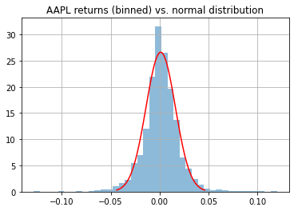
    


```python
check_dist_equities(returns, ['AAPL', 'AMZN', 'MSFT', 'GOOG'], 'AMZN')
```


    
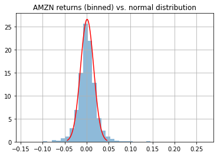
    


```python
check_dist_equities(returns, ['AAPL', 'AMZN', 'MSFT', 'GOOG'], 'MSFT')
```


    
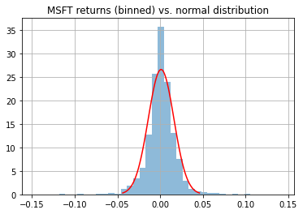
    


```python
check_dist_equities(returns, ['AAPL', 'AMZN', 'MSFT', 'GOOG'], 'GOOG')
```


    
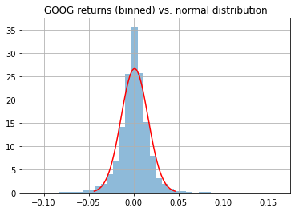
    


Let's also use the Jarque-Bera test to statistically test for normality of returns:


```python
from scipy.stats import jarque_bera

jarquebera_aapl = (jarque_bera(returns['AAPL']))
jarquebera_amzn = (jarque_bera(returns['AMZN']))
jarquebera_msft = (jarque_bera(returns['MSFT']))
jarquebera_goog = (jarque_bera(returns['GOOG']))

print(f"JB statistic for Apple: {jarquebera_aapl[0]}")
print(f"p-value for Apple: {jarquebera_aapl[1]}")
print(f"JB statistic for Amazon: {jarquebera_amzn[0]}")
print(f"p-value for Amazon: {jarquebera_amzn[1]}")
print(f"JB statistic for Microsoft: {jarquebera_msft[0]}")
print(f"p-value for Microsoft: {jarquebera_msft[1]}")
print(f"JB statistic for Google: {jarquebera_goog[0]}")
print(f"p-value for Google: {jarquebera_goog[1]}")
```

    JB statistic for Apple: 3221.716636462663
    p-value for Apple: 0.0
    JB statistic for Amazon: 24210.92112538479
    p-value for Amazon: 0.0
    JB statistic for Microsoft: 9832.804392819193
    p-value for Microsoft: 0.0
    JB statistic for Google: 10677.73943465485
    p-value for Google: 0.0
    

Here, we reject the null hypotheses of normality for all tests and conclude that returns for all of the different stocks are not normal. Hence the parametric approach is not suitable.

This is not directly related to the current problem of estimating Value at Risk, but it is helpful to understand the empirical distribution of returns. Let's check using the normal probability plots as to whether the normal distribution or the Student's t-distribution better fits each of the stock returns.


```python
def gen_normal_student_prob_plots(stock):
    """
    Input: stock (ticker in string format)
    Output: Normal probability plot and student's t probability plot for the stock returns
    """
    Q = returns[stock]
    scipy.stats.probplot(Q, dist=scipy.stats.norm, plot=plt.figure().add_subplot(111))
    plt.title(f"Normal probability plot of {stock} daily returns", weight="bold")
    tdf, tmean, tsigma = scipy.stats.t.fit(Q)
    scipy.stats.probplot(Q, dist=scipy.stats.t, sparams=(tdf, tmean, tsigma), plot=plt.figure().add_subplot(111))
    plt.title(f"Student probability plot of {stock} daily returns", weight="bold")
```


```python
gen_normal_student_prob_plots('AAPL')
```


    
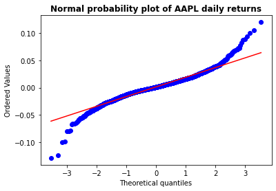
    


    
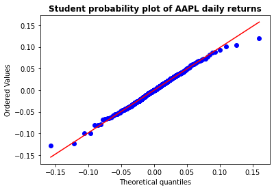
    


```python
gen_normal_student_prob_plots('AMZN')
```


    
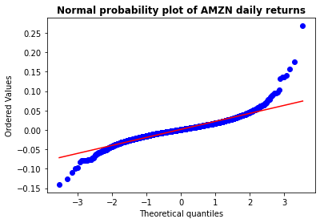
    


    
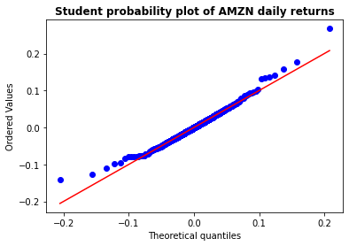
    


```python
gen_normal_student_prob_plots('MSFT')
```


    

    


    

    


```python
gen_normal_student_prob_plots('GOOG')
```


    
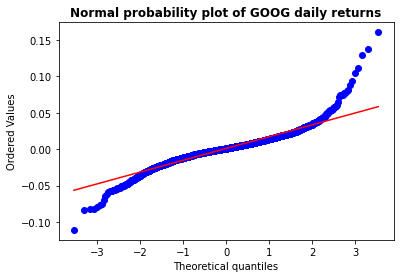
    


    
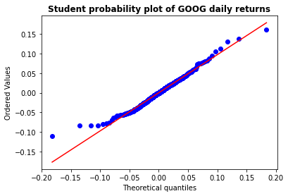
    


As can be seen from the Q-Q plots, we see that the student's t-distribution better fits the stock returns for AAPL, as can be seen from the tails of the distribution.

Next, let's attempt to use the historical and Monte Carlo simulation methods to compute VaR:

2. Historical VaR: (Reference: https://www.northstarrisk.com/historical-var)  

For this methodology, we are making no assumption about the distribution of returns. Using this approach, the VaR is calculated directly from past returns. For example, suppose we want to calculate the 1-day 95% VaR for a portfolio using 5000 days of data. We know that the 95th percentile corresponds to the least worst of the worst 5% of returns. In this case, since we are using 5000 days of data, the VaR simply corresponds to the 250th worst day.

One advantage of historical VaR is that it is extremely simple to calculate. Another advantage is that it is easy to explain to non-risk professionals. A disadvantage, however, is that it can be very slow to react to changing market environments. 


```python
#Reference for Skeleton code: [5]
def VaR_historical(Time, initial_investment, returns, alpha):
    def historicalVaR(returns, alpha):
        """ Inputs:
            Time: Time window for computing historical VaR
            initial_investment: Initial investment level
            returns: Stock returns
            alpha: Percentage of confidence level
            Output: Percentile of the distribution at the given alpha confidence level
        """
        if isinstance(returns, pd.Series):
            return np.percentile(returns, alpha)
        # A passed user-defined-function will be passed a Series for evaluation.
        elif isinstance(returns, pd.DataFrame):
            return returns.aggregate(historicalVaR, alpha)
        else:
            raise TypeError("Expected returns to be dataframe or series")
    hVaR = -historicalVaR(returns['portfolio'], alpha)*np.sqrt(Time)
    return round(initial_investment*hVaR,2)
```


```python
VaR_historical(1, 1000000, returns, 5)
```


    23555.94


Here we are saying with 95% confidence that our portfolio of \$1,000,000, where equivalent amounts have been invested in Amazon, Google, Microsoft and Apple, losses will not exceed \$23,556 over a one day period. We can see that the historical VaR figure is similar to the parametric VaR figure.

3. Monte Carlo simulation:

For this method, we will set the number of simulations to be 20, and the number of time periods ahead to forecast, to 100. The initial value of the portfolio continues to be set at \$1,000,000. By construction of the simulation draws, the matrix $\mathbf{Z}$ will have standard normal entries so we would expect the Monte Carlo VaR estimate to be different in each run.


```python
# Monte Carlo Method for simulation of the stock portfolio at hand
random.seed(10)
mc_sims = 20 # number of simulations
T = 100 #timeframe in days
meanM = np.full(shape=(T, len(weights)), fill_value=meanReturns)
meanM = meanM.T
portfolio_sims = np.full(shape=(T, mc_sims), fill_value=0.0)
initialPortfolio = 1000000
for m in range(0, mc_sims):
    # MC loops
    Z = np.random.normal(size=(T, len(weights)))
    L = np.linalg.cholesky(covMatrix)
    dailyReturns = meanM + np.inner(L, Z)
    portfolio_sims[:,m] = np.cumprod(np.inner(weights, dailyReturns.T)+1)*initialPortfolio
```


```python
plt.plot(portfolio_sims)
plt.ylabel('Portfolio Value ($)')
plt.xlabel('Days')
plt.title('MC simulation of the stock portfolio')
plt.show()
```


    

    


```python
def mcVaR(returns, alpha=5):
    """ Input: pandas series of returns
        Output: percentile on return distribution to a given confidence level alpha
    """
    if isinstance(returns, pd.Series):
        return np.percentile(returns, alpha)
    else:
        raise TypeError("Expected a pandas data series.")
```


```python
portResults = pd.Series(portfolio_sims[-1,:])
VaR_montecarlo = initialPortfolio - mcVaR(portResults, alpha=5)
print('Monte Carlo VaR: {}'.format(round(VaR_montecarlo,2)))
```

    Monte Carlo VaR: 56453.83
    

<b>Methodology 4: CVaR of a portfolio</b>

Next, let's look at expected shortfall, which is another type of risk measure. It is also called the CVaR (Conditional Value at Risk) measure. 

CVaR is what many consider an improvement on VaR, as it takes into account the shape of the returns distribution. It is also known as Expected Shortfall (ES), as it is an expectation over all the different possible losses greater than VaR and their corresponding estimated likelihoods.


```python
def cvar(weights, stockList, initial_investment, returns, alpha):
    # Call out to our existing function
    conf_level = 1-alpha
    parametric_var = var_parametric(weights, stockList, initial_investment, returns, conf_level)
    port_returns = returns[stockList].dot(weights)
    # Get back to a return rather than an absolute loss
    var_pct_loss = parametric_var / initial_investment
    return - initial_investment * np.nanmean(port_returns[port_returns < var_pct_loss])
```


```python
cvar(np.array([0.25,0.25,0.25,0.25]), ['AAPL', 'AMZN', 'MSFT', 'GOOG'], 1000000, returns, 0.05)
```


    36717.30483182358


CVaR captures more information about the shape of the distribution, i.e. the moments of the distribution. If the tails have more mass, this will capture that. In general it is considered to be a far superior metric compared with VaR and it should be used over VaR in most cases.

<b>Methodology 5: Marginal VaR (mVaR)</b> (Reference: https://www.northstarrisk.com/marginalvalueatrisk)

Marginal VaR computes the incremental change in aggregate risk to a firm or portfolio due to adding one more investment. The incremental VaR is sometimes confused with the marginal VaR. Incremental VaR tells you the precise amount of risk a position is adding or subtracting from the whole portfolio, while marginal VaR is just an estimation of the change in total amount of risk. In both cases, for incremental VaR and for mVaR, a positive number indicates that the position is adding risk to the portfolio.

The formula for mVaR for some investment $i$ in the portfolio is:

$(mVaR)_{i} = $ (VaR of existing portfolio) - (VaR of the portfolio without investment $i$)

For the mVaR calculations, we will assume the value of VaR from Monte Carlo simulation. This is because Monte Carlo VaR is the most flexible method in terms of lesser assumptions imposed on the model and data.


Step 1: Construct the returns, covariance matrices and other related variables for the following 3 states of the portfolio (the initial portfolio minus one of the stocks for each case):

`['AMZN', 'MSFT', 'GOOG'], ['AAPL', 'MSFT', 'GOOG'], ['AAPL', 'AMZN', 'GOOG'], ['AAPL', 'AMZN', 'MSFT']`


```python
stockList_noaapl = ['AMZN', 'MSFT', 'GOOG']
stockList_noamzn = ['AAPL', 'MSFT', 'GOOG']
stockList_nomsft = ['AAPL', 'AMZN', 'GOOG']
stockList_nogoog = ['AAPL', 'AMZN', 'MSFT']
#We have start and end dates for data as before
endDate = dt.datetime(2022, 9, 19) 
startDate = endDate - dt.timedelta(days=5000)
returns_noaapl, meanReturns_noaapl, covMatrix_noaapl = getData(stockList_noaapl, start=startDate, end=endDate)
returns_noamzn, meanReturns_noamzn, covMatrix_noamzn = getData(stockList_noamzn, start=startDate, end=endDate)
returns_nomsft, meanReturns_nomsft, covMatrix_nomsft = getData(stockList_nomsft, start=startDate, end=endDate)
returns_nogoog, meanReturns_nogoog, covMatrix_nogoog = getData(stockList_nogoog, start=startDate, end=endDate)
#as done before, let's drop the null values from the returns matrix
returns_noaapl = returns_noaapl.dropna()
returns_noamzn = returns_noamzn.dropna()
returns_nomsft = returns_nomsft.dropna()
returns_nogoog = returns_nogoog.dropna()
weights_minusonestock = [1/3, 1/3, 1/3]
weights_minusonestock /= np.sum(weights_minusonestock)
returns_noaapl['portfolio'] = returns_noaapl.dot(weights_minusonestock)
returns_noamzn['portfolio'] = returns_noamzn.dot(weights_minusonestock)
returns_nomsft['portfolio'] = returns_nomsft.dot(weights_minusonestock)
returns_nogoog['portfolio'] = returns_nogoog.dot(weights_minusonestock)
```

Next, let's do the Monte Carlo estimation work as done before. For this, we will continue to assume `mc_sims = 20` and `T = 100`.

Step 2: Construct the Monte Carlo simulations and Monte Carlo VaR values for each of the different states of the portfolio:


```python
mcvar_minusonestock = []
random.seed(10)
def mc_simulation_mcvar(weights, meanReturns, covMatrix, stock):
    """
    Inputs: 
    The weights, mean returns and covariance matrices are from a certain state of the portfolio. 
    stock: String for the name of the stock (e.g. Apple)
    Output: Plot for MC simulation of the portfolio and MC VaR value.
    """
    # Monte Carlo Method for simulation of the stock portfolio without Apple
    meanM = np.full(shape=(T, len(weights)), fill_value=meanReturns)
    meanM = meanM.T
    portfolio_sims = np.full(shape=(T, mc_sims), fill_value=0.0)
    initialPortfolio = 1000000
    for m in range(0, mc_sims):
        # MC loops
        Z = np.random.normal(size=(T, len(weights)))
        L = np.linalg.cholesky(covMatrix)
        dailyReturns = meanM + np.inner(L, Z)
        portfolio_sims[:,m] = np.cumprod(np.inner(weights, dailyReturns.T)+1)*initialPortfolio

    portResults = pd.Series(portfolio_sims[-1,:])
    VaR = initialPortfolio - mcVaR(portResults, alpha=5)
    mcvar_minusonestock.append(VaR)

    plt.plot(portfolio_sims)
    plt.ylabel('Portfolio Value ($)')
    plt.xlabel('Days')
    plt.title(f'MC simulation of the stock portfolio without {stock}')
    plt.show()
    print(f'Monte Carlo VaR without {stock}: ' + format(round(VaR,2)))
    
```


```python
mc_simulation_mcvar(weights_minusonestock, meanReturns_noaapl, covMatrix_noaapl, 'Apple')
```


    
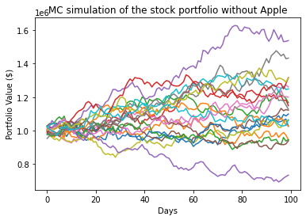
    


    Monte Carlo VaR without Apple: 70975.08
    


```python
mc_simulation_mcvar(weights_minusonestock, meanReturns_noamzn, covMatrix_noamzn, 'Amazon')
```


    
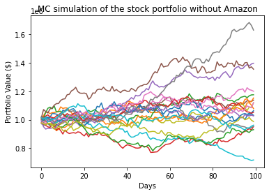
    


    Monte Carlo VaR without Amazon: 80363.18
    


```python
mc_simulation_mcvar(weights_minusonestock, meanReturns_nomsft, covMatrix_nomsft, 'Microsoft')
```


    
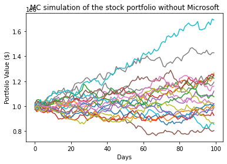
    


    Monte Carlo VaR without Microsoft: 146681.43
    


```python
mc_simulation_mcvar(weights_minusonestock, meanReturns_nogoog, covMatrix_nogoog, 'Google')
```


    
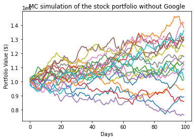
    


    Monte Carlo VaR without Google: 145331.02
    

Step 3: Compute the mVaR values:


```python
mVaR_aapl = VaR_montecarlo - mcvar_minusonestock[0]
mVaR_amzn = VaR_montecarlo - mcvar_minusonestock[1]
mVaR_msft = VaR_montecarlo - mcvar_minusonestock[2]
mVaR_goog = VaR_montecarlo - mcvar_minusonestock[3]
print(f"Marginal VaR for Apple stock: {mVaR_aapl} \n"
f"Marginal VaR for Amazon stock: {mVaR_amzn} \n"
f"Marginal VaR for Microsoft stock: {mVaR_msft} \n"
f"Marginal VaR for Google stock: {mVaR_goog}")
```

    Marginal VaR for Apple stock: -14521.249704778427 
    Marginal VaR for Amazon stock: -23909.35948445683 
    Marginal VaR for Microsoft stock: -90227.60783149442 
    Marginal VaR for Google stock: -88877.19277623529
    

We can see that the marginal VaR values for each of the positions is negative. This makes sense from a portfolio management standpoint, since the more equities one holds in a portfolio, the unsystematic risk of the portfolio should be expected to fall. The risk reduction for each of Apple and Amazon is smallest since the Monte Carlo VaR without Apple and Amazon respectively are smaller values. This shows that Apple and Amazon are risky stocks to invest in, on the basis of data from the past 5000 days (counting from 19th September 2022 and backwards).

<b>Methodology 6: Incremental VaR</b>

Incremental VaR is thus a more precise measurement, as opposed to marginal value at risk, which is an estimation using mostly the same information. To calculate the incremental value at risk, an investor needs to know the portfolio's standard deviation, the portfolio's rate of return, and the asset in question's rate of return and portfolio share [10]. 

(References: https://riskprep.com/tutorials/var-disaggregation-marginal-and-component-var/ ; https://www.northstarrisk.com/incrementalvalueatrisk) The mathematical formula for the incremental VaR is:

$iVaR_{0.95,i} = \frac{d(VaR_{0.95, P})}{dw_{i}}w_{i}$

This can be expressed using a trivial derivation in the following manner:

$iVaR_{0.95,i} = \Phi^{-1}(0.95)V_{P}w_{i}$

How do we get this formula? Let's walk through the derivation:

First, let's define some terms. We have that $V_{P}$ is the total portfolio value in dollars, $V_{i}$ is the dollar value of the $i$-th asset in the portfolio and $V_{i} = V_{P}w_{i}$.

We have that $VaR_{0.95,P}$ is the VaR for the portfolio P evaluated at 95% confidence level, and the formula is $VaR_{0.95,P} = \Phi^{-1}(0.95)\sigma_{P}V_{P}$. Hence, we can write $VaR_{0.95,P}$ as:

$VaR_{0.95,P} = \Phi^{-1}(0.95)\sigma_{P}\frac{V_{i}}{w_{i}}$. Plugging this into the fomula for incremental VaR for the $i$-th asset:

$iVaR_{0.95,i} = \frac{d}{dw_{i}}(\Phi^{-1}(0.95)\sigma_{P}\frac{V_{i}}{w_{i}})w_{i}$. By the product rule:

$iVaR_{i} = \Phi^{-1}(0.95)\{\frac{d\sigma_{P}}{dw_{i}}\frac{V_{i}}{w_{i}} + \frac{d}{dw_{i}}(\frac{V_{i}}{w_{i}})\sigma_{P}\}w_{i}$

The expression on the right hand side can be written as:

$\Phi^{-1}(0.95)\{\frac{\sigma_{iP}}{\sigma_{P}}\frac{V_{i}}{w_{i}} - \frac{V_{i}}{{w_{i}}^{2}}\sigma_{P}\}w_{i}$

$= \Phi^{-1}(0.95)\{\frac{\sigma_{iP}}{\sigma_{P}}\frac{V_{i}}{w_{i}} - \frac{1}{{w_{i}}}\frac{V_{i}}{{w_{i}}}\sigma_{P}\}w_{i}$

$= \Phi^{-1}(0.95)\{\frac{\sigma_{iP}}{\sigma_{P}}\frac{V_{i}}{w_{i}} - \frac{\sigma_{P}}{{w_{i}}}V_{P}\}w_{i}$

$\boxed{iVaR_{i} = \Phi^{-1}(0.95)\{\frac{\sigma_{iP}}{\sigma_{P}}V_{i} - \sigma_{P}V_{P}\}}$

Here, $\sigma_{iP} = (\mathbf{w}^{T}\Sigma)_{i}$. Let's implement the boxed equation in Python:


```python
import scipy.stats
#find critical value z = \Phi^{-1}(0.95)
z = scipy.stats.norm.ppf(.05)

sigma_P = portfolioPerformance(weights, meanReturns, covMatrix)[1]
V_P = initialPortfolio
#since the weights in our setting have been assumed to be 1/4 for all equities, so V_{i} = $250,000 \forall i=1,2,3,4 where i represents the stock
V_i = 250000
inner_prod_weightscov = np.inner(weights, covMatrix)

#we can now define the function to store incremental VaR values
def gen_incr_var():
    incr_var = []
    for i in range(len(inner_prod_weightscov)):
        incr_var.append(round(z*((inner_prod_weightscov[i])*(V_i) - sigma_P*V_P), 2))
    return incr_var 
```


```python
gen_incr_var()
```


    [24568.07, 24547.42, 24571.5, 24569.32]


Recall that the incremental VaR indicates the impact of a small change in a position on the overall value of the portfolio. However, mVaR tells us how much removing the entire position would change the overall VaR of the portfolio.

<b>Future Extensions to measuring market risk:</b>

There is no single right way to estimate VaR or the market risk of a portfolio using any other measure.

The advantages of VaR include the following: It is a simple concept; it is relatively easy to understand and easily communicated, capturing much information in a single number. It can be useful in comparing risks across asset classes, portfolios, and trading units and, as such, facilitates capital allocation decisions. It can be used for performance evaluation and can be verified by using backtesting. It is widely accepted by regulators.

The primary limitations of VaR are that it is a subjective measure and highly sensitive to numerous discretionary choices made in the course of computation. It can underestimate the frequency of extreme events. It fails to account for the lack of liquidity and is sensitive to correlation risk. It is vulnerable to trending or volatility regimes and is often misunderstood as a worst-case scenario. It can oversimplify the picture of risk and focuses heavily on the left tail.

Scenario measures, including stress tests, are risk models that evaluate how a portfolio will perform under certain high-stress market conditions. Stress tests apply extreme negative stress to a particular portfolio exposure. Scenario measures can be based on actual historical scenarios or on hypothetical scenarios. Sensitivity and scenario risk measures can complement VaR. They do not need to rely on history, and scenarios can be designed to overcome an assumption of normal distributions. Limitations of scenario measures include the following: Historical scenarios are unlikely to re-occur in exactly the same way. Hypothetical scenarios may incorrectly specify how assets will co-move and thus may get the magnitude of movements wrong. And, it is difficult to establish appropriate limits on a scenario analysis or stress test. 

Nonetheless, scenario measures is a future extension worth looking into.

**Other References:**

1. Lecture 4 Notes, STAT0011: Decision and Risk (University College London)
2. https://www.interviewqs.com/blog/value-at-risk
3. https://en.wikipedia.org/wiki/Dot_product#:~:targetText=In%20mathematics%2C%20the%20dot%20product,and%20returns%20a%20single%20number.
4. https://docs.scipy.org/doc/scipy/reference/generated/scipy.stats.norm.html
5. https://quantpy.com.au/risk-management/value-at-risk-var-and-conditional-var-cvar/
6. https://www.quantrocket.com/codeload/quant-finance-lectures/quant_finance_lectures/Lecture40-VaR-and-CVaR.ipynb.html
7. https://www.kaggle.com/code/liamhealy/copulas-in-python
8. https://www.cfainstitute.org/en/membership/professional-development/refresher-readings/measuring-managing-market-risk
9. https://www.investopedia.com/ask/answers/041415/what-are-some-common-measures-risk-used-risk-management.asp
10. https://www.investopedia.com/terms/m/marginal-var.asp#:~:text=What%20Is%20Marginal%20VaR%3F,positions%20from%20an%20investment%20portfolio.
