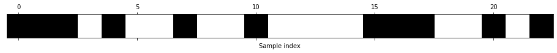
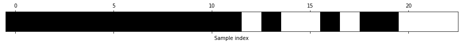
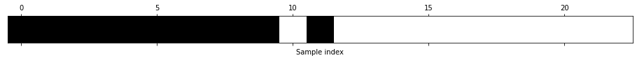
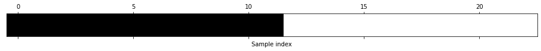
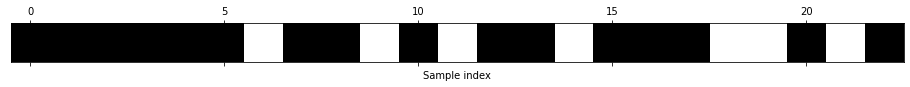

# Nasr's Musings on Tennis 2: An overview of supervised machine learning problems for the classification problem of predicting a tennis match winner having lower or higher rank than the loser

<b>Summary of Notebook:</b>

In the previous notebook (Nasr's Musings on Tennis 1), patterns between WRank and LRank were extracted to understand outcomes of tennis matches at a given Grand Slam in 2021. In this notebook, the overarching aim is to compare different supervised learning algorithms for the binary classification problem of predicting a tennis match winner having lower or higher rank than the loser. The final classification algorithm that had the best overall performance was linear support vector machines for classification (linear SVC).

Let's first import all the necessary libraries:


```python
import numpy as np
import pandas as pd
import matplotlib.pyplot as plt
import sklearn
import math
import random
import mglearn
from datetime import datetime
pd.options.mode.chained_assignment = None
```

**Dataset/s used for the analysis:**

The datasets used for this analysis is tennis data on Grand Slams for the past 5 years (2021 and backwards). Since Wimbledon 2020 did not take place, data on Wimbledon 2016 is collected instead. The purpose of collecting data for the past 5 years is to have a large enough data-set for obtaining scalable results.

Next, let's load in the necessary datasets, which has been sourced from http://tennis-data.co.uk/:


```python
ausopen_2021_atp = pd.read_csv("ausopen_2021_atp.csv",delimiter=',',index_col=0)
frenchopen_2021_atp = pd.read_csv("frenchopen_2021_atp.csv",delimiter=',',index_col=0)
wimbledon_2021_atp = pd.read_csv("wimbledon_2021_atp.csv",delimiter=',',index_col=0)
usopen_2021_atp = pd.read_csv("usopen_2021_atp.csv",delimiter=',',index_col=0)
ausopen_2020_atp = pd.read_csv("ausopen_2020_atp.csv",delimiter=',',index_col=0)
frenchopen_2020_atp = pd.read_csv("frenchopen_2020_atp.csv",delimiter=',',index_col=0)
usopen_2020_atp = pd.read_csv("usopen_2020_atp.csv",delimiter=',',index_col=0)
ausopen_2019_atp = pd.read_csv("ausopen_2019_atp.csv",delimiter=',',index_col=0)
frenchopen_2019_atp = pd.read_csv("frenchopen_2019_atp.csv",delimiter=',',index_col=0)
wimbledon_2019_atp = pd.read_csv("wimbledon_2019_atp.csv",delimiter=',',index_col=0)
usopen_2019_atp = pd.read_csv("usopen_2019_atp.csv",delimiter=',',index_col=0)
ausopen_2018_atp = pd.read_csv("ausopen_2018_atp.csv",delimiter=',',index_col=0)
frenchopen_2018_atp = pd.read_csv("frenchopen_2018_atp.csv",delimiter=',',index_col=0)
wimbledon_2018_atp = pd.read_csv("wimbledon_2018_atp.csv",delimiter=',',index_col=0)
usopen_2018_atp = pd.read_csv("usopen_2018_atp.csv",delimiter=',',index_col=0)
ausopen_2017_atp = pd.read_csv("ausopen_2017_atp.csv",delimiter=',',index_col=0)
frenchopen_2017_atp = pd.read_csv("frenchopen_2017_atp.csv",delimiter=',',index_col=0)
wimbledon_2017_atp = pd.read_csv("wimbledon_2017_atp.csv",delimiter=',',index_col=0)
usopen_2017_atp = pd.read_csv("usopen_2017_atp.csv",delimiter=',',index_col=0)
wimbledon_2016_atp = pd.read_csv("wimbledon_2016_atp.csv",delimiter=',',index_col=0)
```

The following information provides details on each covariate in the dataframes above. Further details can be found on http://tennis-data.co.uk/notes.txt and the reader is encouraged to read this in detail.

Location = Venue of tournament

Tournament = Name of tounament (including sponsor if relevant)

Date = Date of match 

Series = Name of ATP tennis series (Grand Slam, Masters, International or International Gold)

Tier = Tier (tournament ranking) of WTA tennis series.

Court = Type of court (outdoors or indoors)

Surface = Type of surface (clay, hard, carpet or grass)

Round = Round of match

Best of = Maximum number of sets playable in match

Winner = Match winner

Loser = Match loser

WRank = ATP Entry ranking of the match winner as of the start of the tournament

LRank = ATP Entry ranking of the match loser as of the start of the tournament

WPts = ATP Entry points of the match winner as of the start of the tournament

LPts = ATP Entry points of the match loser as of the start of the tournament

W1 = Number of games won in 1st set by match winner

L1 = Number of games won in 1st set by match loser

W2 = Number of games won in 2nd set by match winner

L2 = Number of games won in 2nd set by match loser

W3 = Number of games won in 3rd set by match winner

L3 = Number of games won in 3rd set by match loser

W4 = Number of games won in 4th set by match winner

L4 = Number of games won in 4th set by match loser

W5 = Number of games won in 5th set by match winner

L5 = Number of games won in 5th set by match loser

Wsets = Number of sets won by match winner

Lsets = Number of sets won by match loser

The question that we would like to answer in this notebook is the following: what features are most important in predicting whether an upset will happen in a given Grand Slam match across 2021? We can define an upset in the following way: WRank > LRank.

Quoting from [1], when doing feature selection, it can be a good idea to reduce the number of features to only the most useful ones, and discard the rest. This can lead to simpler models that generalise better. To know how "good" each feature is, there are 3 basic strategies: <i>univariate statistics, model-based selection, iterative selection</i>.

All these methods are supervised learning methods, i.e. they need the target for fitting the model. Therefore, only the data is needed to be split into training and test sets, and feature selection needs to be fit on the training part of the data. 

1. <b>Univariate Statistics:</b>

In univariate statistics, we compute whether there is a statistically significant relationship between each feature and the target. Then the features related with the highest confidence are selected. In the case of classification, this is called Analysis of Variance (ANOVA). A key property of these tests is that they are univariate, i.e. they only consider each feature individually. Therefore, a potential downside of using this is that a feature may be discarded if it is only informative when combined with another feature. Whilst univariate tests are fast to compute and don't require building a model, a downside is that they are independent of the model you may want to apply after the feature selection.

2. <b>Iterative Feature Selection:</b>

Here, a series of models are built, with varying numbers of features. There are two basic methods: starting with no features and adding features one by one until some stopping criterion is reached. Since a series of models are built, these methods are much more computationally expensive than the methods discussed previously. An example of this type of method is recursive feature elimination (RFE). This framework starts with all features, builds a model, and discards the least important feature according to the model. Then, a new model is built using all but the discarded feature, and so on until only a prespecified number of features are left. 

Overall, if one is unsure when selecting what to input to a machine learning algorithm, automatic feature selection can be quite helpful. It is good for reducing the amount of features needed, to allow for more interpretable models. 

3. <b>Utilising expert knowledge:</b>

While the purpose of machine learning in many cases is to avoid having to create a set of expert-designed rules, that does not mean that prior knowledge of the domain should be discarded. Hence, useful features can be identified prior to fitting a model.

Before doing the analysis, let's define a target variable that is 1 if WRank > LRank and 0 otherwise. Note that by construction, WRank $\neq$ LRank.


```python
#construct the feature matrix
grandslam_2016to21_atp = pd.concat([ausopen_2021_atp, frenchopen_2021_atp, wimbledon_2021_atp, usopen_2021_atp])
grandslam_2016to21_atp = pd.concat([grandslam_2016to21_atp, ausopen_2020_atp, frenchopen_2020_atp, usopen_2020_atp])
grandslam_2016to21_atp = pd.concat([grandslam_2016to21_atp, ausopen_2019_atp, frenchopen_2019_atp, wimbledon_2019_atp, usopen_2019_atp])
grandslam_2016to21_atp = pd.concat([grandslam_2016to21_atp, ausopen_2018_atp, frenchopen_2018_atp, wimbledon_2018_atp, usopen_2018_atp])
grandslam_2016to21_atp = pd.concat([grandslam_2016to21_atp, ausopen_2017_atp, frenchopen_2017_atp, wimbledon_2017_atp, usopen_2017_atp])
grandslam_2016to21_atp = pd.concat([grandslam_2016to21_atp, wimbledon_2016_atp])
grandslam_2016to21_atp_featurematrix = grandslam_2016to21_atp.loc[:, grandslam_2016to21_atp.columns!='WRank']
grandslam_2016to21_atp_featurematrix = grandslam_2016to21_atp.loc[:, grandslam_2016to21_atp.columns!='LRank']
grandslam_2016to21_atp_featurematrix = grandslam_2016to21_atp_featurematrix.loc[:, grandslam_2016to21_atp_featurematrix.columns!='EXW']
grandslam_2016to21_atp_featurematrix = grandslam_2016to21_atp_featurematrix.loc[:, grandslam_2016to21_atp_featurematrix.columns!='EXL']
grandslam_2016to21_atp_featurematrix = grandslam_2016to21_atp_featurematrix.loc[:, grandslam_2016to21_atp_featurematrix.columns!='LBW']
grandslam_2016to21_atp_featurematrix = grandslam_2016to21_atp_featurematrix.loc[:, grandslam_2016to21_atp_featurematrix.columns!='LBL']
grandslam_2016to21_atp_featurematrix
```


<div>
<style scoped>
    .dataframe tbody tr th:only-of-type {
        vertical-align: middle;
    }

    .dataframe tbody tr th {
        vertical-align: top;
    }

    .dataframe thead th {
        text-align: right;
    }
</style>
<table border="1" class="dataframe">
  <thead>
    <tr style="text-align: right;">
      <th></th>
      <th>Location</th>
      <th>Tournament</th>
      <th>Date</th>
      <th>Series</th>
      <th>Court</th>
      <th>Surface</th>
      <th>Round</th>
      <th>Best of</th>
      <th>Winner</th>
      <th>Loser</th>
      <th>...</th>
      <th>Lsets</th>
      <th>Comment</th>
      <th>B365W</th>
      <th>B365L</th>
      <th>PSW</th>
      <th>PSL</th>
      <th>MaxW</th>
      <th>MaxL</th>
      <th>AvgW</th>
      <th>AvgL</th>
    </tr>
    <tr>
      <th>ATP</th>
      <th></th>
      <th></th>
      <th></th>
      <th></th>
      <th></th>
      <th></th>
      <th></th>
      <th></th>
      <th></th>
      <th></th>
      <th></th>
      <th></th>
      <th></th>
      <th></th>
      <th></th>
      <th></th>
      <th></th>
      <th></th>
      <th></th>
      <th></th>
      <th></th>
    </tr>
  </thead>
  <tbody>
    <tr>
      <th>5</th>
      <td>Melbourne</td>
      <td>Australian Open</td>
      <td>08/02/2021</td>
      <td>Grand Slam</td>
      <td>Outdoor</td>
      <td>Hard</td>
      <td>1st Round</td>
      <td>5</td>
      <td>Raonic M.</td>
      <td>Coria F.</td>
      <td>...</td>
      <td>0.0</td>
      <td>Completed</td>
      <td>1.01</td>
      <td>26.00</td>
      <td>1.01</td>
      <td>26.84</td>
      <td>1.02</td>
      <td>34.00</td>
      <td>1.01</td>
      <td>21.38</td>
    </tr>
    <tr>
      <th>5</th>
      <td>Melbourne</td>
      <td>Australian Open</td>
      <td>08/02/2021</td>
      <td>Grand Slam</td>
      <td>Outdoor</td>
      <td>Hard</td>
      <td>1st Round</td>
      <td>5</td>
      <td>Mannarino A.</td>
      <td>Novak D.</td>
      <td>...</td>
      <td>0.0</td>
      <td>Completed</td>
      <td>1.66</td>
      <td>2.20</td>
      <td>1.66</td>
      <td>2.37</td>
      <td>1.83</td>
      <td>2.37</td>
      <td>1.68</td>
      <td>2.19</td>
    </tr>
    <tr>
      <th>5</th>
      <td>Melbourne</td>
      <td>Australian Open</td>
      <td>08/02/2021</td>
      <td>Grand Slam</td>
      <td>Outdoor</td>
      <td>Hard</td>
      <td>1st Round</td>
      <td>5</td>
      <td>Ruusuvuori E.</td>
      <td>Monfils G.</td>
      <td>...</td>
      <td>2.0</td>
      <td>Completed</td>
      <td>1.61</td>
      <td>2.30</td>
      <td>1.56</td>
      <td>2.59</td>
      <td>1.78</td>
      <td>2.60</td>
      <td>1.56</td>
      <td>2.42</td>
    </tr>
    <tr>
      <th>5</th>
      <td>Melbourne</td>
      <td>Australian Open</td>
      <td>08/02/2021</td>
      <td>Grand Slam</td>
      <td>Outdoor</td>
      <td>Hard</td>
      <td>1st Round</td>
      <td>5</td>
      <td>Moutet C.</td>
      <td>Millman J.</td>
      <td>...</td>
      <td>2.0</td>
      <td>Completed</td>
      <td>3.00</td>
      <td>1.40</td>
      <td>2.88</td>
      <td>1.48</td>
      <td>3.05</td>
      <td>1.50</td>
      <td>2.78</td>
      <td>1.44</td>
    </tr>
    <tr>
      <th>5</th>
      <td>Melbourne</td>
      <td>Australian Open</td>
      <td>08/02/2021</td>
      <td>Grand Slam</td>
      <td>Outdoor</td>
      <td>Hard</td>
      <td>1st Round</td>
      <td>5</td>
      <td>Opelka R.</td>
      <td>Lu Y.</td>
      <td>...</td>
      <td>0.0</td>
      <td>Completed</td>
      <td>1.06</td>
      <td>10.00</td>
      <td>1.05</td>
      <td>14.72</td>
      <td>1.07</td>
      <td>15.00</td>
      <td>1.04</td>
      <td>11.40</td>
    </tr>
    <tr>
      <th>...</th>
      <td>...</td>
      <td>...</td>
      <td>...</td>
      <td>...</td>
      <td>...</td>
      <td>...</td>
      <td>...</td>
      <td>...</td>
      <td>...</td>
      <td>...</td>
      <td>...</td>
      <td>...</td>
      <td>...</td>
      <td>...</td>
      <td>...</td>
      <td>...</td>
      <td>...</td>
      <td>...</td>
      <td>...</td>
      <td>...</td>
      <td>...</td>
    </tr>
    <tr>
      <th>39</th>
      <td>London</td>
      <td>Wimbledon</td>
      <td>06/07/16</td>
      <td>Grand Slam</td>
      <td>Outdoor</td>
      <td>Grass</td>
      <td>Quarterfinals</td>
      <td>5</td>
      <td>Berdych T.</td>
      <td>Pouille L.</td>
      <td>...</td>
      <td>0.0</td>
      <td>Completed</td>
      <td>1.22</td>
      <td>4.33</td>
      <td>1.27</td>
      <td>4.35</td>
      <td>1.28</td>
      <td>4.50</td>
      <td>1.24</td>
      <td>4.07</td>
    </tr>
    <tr>
      <th>39</th>
      <td>London</td>
      <td>Wimbledon</td>
      <td>06/07/16</td>
      <td>Grand Slam</td>
      <td>Outdoor</td>
      <td>Grass</td>
      <td>Quarterfinals</td>
      <td>5</td>
      <td>Murray A.</td>
      <td>Tsonga J.W.</td>
      <td>...</td>
      <td>2.0</td>
      <td>Completed</td>
      <td>1.10</td>
      <td>7.00</td>
      <td>1.12</td>
      <td>8.01</td>
      <td>1.13</td>
      <td>8.01</td>
      <td>1.10</td>
      <td>6.94</td>
    </tr>
    <tr>
      <th>39</th>
      <td>London</td>
      <td>Wimbledon</td>
      <td>08/07/16</td>
      <td>Grand Slam</td>
      <td>Outdoor</td>
      <td>Grass</td>
      <td>Semifinals</td>
      <td>5</td>
      <td>Raonic M.</td>
      <td>Federer R.</td>
      <td>...</td>
      <td>2.0</td>
      <td>Completed</td>
      <td>2.62</td>
      <td>1.50</td>
      <td>2.55</td>
      <td>1.55</td>
      <td>2.66</td>
      <td>1.62</td>
      <td>2.50</td>
      <td>1.54</td>
    </tr>
    <tr>
      <th>39</th>
      <td>London</td>
      <td>Wimbledon</td>
      <td>08/07/16</td>
      <td>Grand Slam</td>
      <td>Outdoor</td>
      <td>Grass</td>
      <td>Semifinals</td>
      <td>5</td>
      <td>Murray A.</td>
      <td>Berdych T.</td>
      <td>...</td>
      <td>0.0</td>
      <td>Completed</td>
      <td>1.10</td>
      <td>7.00</td>
      <td>1.15</td>
      <td>6.75</td>
      <td>1.17</td>
      <td>7.50</td>
      <td>1.12</td>
      <td>6.55</td>
    </tr>
    <tr>
      <th>39</th>
      <td>London</td>
      <td>Wimbledon</td>
      <td>10/07/16</td>
      <td>Grand Slam</td>
      <td>Outdoor</td>
      <td>Grass</td>
      <td>The Final</td>
      <td>5</td>
      <td>Murray A.</td>
      <td>Raonic M.</td>
      <td>...</td>
      <td>0.0</td>
      <td>Completed</td>
      <td>1.25</td>
      <td>4.33</td>
      <td>1.27</td>
      <td>4.36</td>
      <td>4.36</td>
      <td>1.30</td>
      <td>3.97</td>
      <td>1.26</td>
    </tr>
  </tbody>
</table>
<p>2540 rows × 34 columns</p>
</div>


```python
#construct the target vector
upset_or_expected = (grandslam_2016to21_atp['WRank'] - grandslam_2016to21_atp['LRank'] >= 0).astype(int)
```


```python
#check that there is only 1 unique entry i.e. Outdoor in the "Court" column
pd.unique(grandslam_2016to21_atp_featurematrix['Court']) 
```


    array(['Outdoor'], dtype=object)


**Data cleaning, data transformation and exploratory data analysis (EDA) methods performed:**

Before running machine learning algorithms on the data, we will need to perform some <u>data preprocessing steps</u>:

Step 1 - Location and Tournament: Since the semantic meaning of the entries in both columns overlaps, hence let's drop the "Location" column and replace the "Tournament" column into one hot encoded vectors. 

Step 2 - Date: Convert to date time format.

Step 3 - Series: Remove this column as all entries are "Grand Slam" here.

Step 4 - Court: Remove this column as we know all Grand Slam are outdoor court events by construction.

Step 5 - Surface: Convert to 3 one hot encoded vectors, where each one hot encoded vector is with respect to surface.

Step 6 - Round: Convert to a categorical variable, but not one hot encoded. This is because the value will incorporate time information about the data. Hence, set: 1st Round=1, 2nd Round=2, 3rd Round=3, 4th Round=4, Quarterfinals=5, Semifinals=6, The Final=7.

Step 7 - Best of: Remove this column as we know all matches are best of 5 sets in Grand Slams.

Step 8 - Winner and Loser: Let's remove these columns for now, but will add them whenever textual data analysis is used.

Step 9 - WRank and LRank: These features will be removed from the feature matrix as by the data generating process, they are a linear combination of the target values. 

Step 10 - The remaining columns will be kept as they are, except the last 9 columns which will be removed since the interest is not in betting odds.

Step 11 - Replace all the NaNs with zeros.

Step 12 - Shuffle the order of the rows given (when doing time series analysis, will arrange it back in chronological order).

Step 13 - Create a subset dataframe without the date - when doing time series analysis, the dataframe with dates will be used.

Let's go through these steps one by one:


```python
#Step 1
grandslam_2016to21_atp_featurematrix.drop('Location', axis=1, inplace=True) 
grandslam_2016to21_atp_featurematrix
```


<div>
<style scoped>
    .dataframe tbody tr th:only-of-type {
        vertical-align: middle;
    }

    .dataframe tbody tr th {
        vertical-align: top;
    }

    .dataframe thead th {
        text-align: right;
    }
</style>
<table border="1" class="dataframe">
  <thead>
    <tr style="text-align: right;">
      <th></th>
      <th>Tournament</th>
      <th>Date</th>
      <th>Series</th>
      <th>Court</th>
      <th>Surface</th>
      <th>Round</th>
      <th>Best of</th>
      <th>Winner</th>
      <th>Loser</th>
      <th>WRank</th>
      <th>...</th>
      <th>Lsets</th>
      <th>Comment</th>
      <th>B365W</th>
      <th>B365L</th>
      <th>PSW</th>
      <th>PSL</th>
      <th>MaxW</th>
      <th>MaxL</th>
      <th>AvgW</th>
      <th>AvgL</th>
    </tr>
    <tr>
      <th>ATP</th>
      <th></th>
      <th></th>
      <th></th>
      <th></th>
      <th></th>
      <th></th>
      <th></th>
      <th></th>
      <th></th>
      <th></th>
      <th></th>
      <th></th>
      <th></th>
      <th></th>
      <th></th>
      <th></th>
      <th></th>
      <th></th>
      <th></th>
      <th></th>
      <th></th>
    </tr>
  </thead>
  <tbody>
    <tr>
      <th>5</th>
      <td>Australian Open</td>
      <td>08/02/2021</td>
      <td>Grand Slam</td>
      <td>Outdoor</td>
      <td>Hard</td>
      <td>1st Round</td>
      <td>5</td>
      <td>Raonic M.</td>
      <td>Coria F.</td>
      <td>14</td>
      <td>...</td>
      <td>0.0</td>
      <td>Completed</td>
      <td>1.01</td>
      <td>26.00</td>
      <td>1.01</td>
      <td>26.84</td>
      <td>1.02</td>
      <td>34.00</td>
      <td>1.01</td>
      <td>21.38</td>
    </tr>
    <tr>
      <th>5</th>
      <td>Australian Open</td>
      <td>08/02/2021</td>
      <td>Grand Slam</td>
      <td>Outdoor</td>
      <td>Hard</td>
      <td>1st Round</td>
      <td>5</td>
      <td>Mannarino A.</td>
      <td>Novak D.</td>
      <td>36</td>
      <td>...</td>
      <td>0.0</td>
      <td>Completed</td>
      <td>1.66</td>
      <td>2.20</td>
      <td>1.66</td>
      <td>2.37</td>
      <td>1.83</td>
      <td>2.37</td>
      <td>1.68</td>
      <td>2.19</td>
    </tr>
    <tr>
      <th>5</th>
      <td>Australian Open</td>
      <td>08/02/2021</td>
      <td>Grand Slam</td>
      <td>Outdoor</td>
      <td>Hard</td>
      <td>1st Round</td>
      <td>5</td>
      <td>Ruusuvuori E.</td>
      <td>Monfils G.</td>
      <td>86</td>
      <td>...</td>
      <td>2.0</td>
      <td>Completed</td>
      <td>1.61</td>
      <td>2.30</td>
      <td>1.56</td>
      <td>2.59</td>
      <td>1.78</td>
      <td>2.60</td>
      <td>1.56</td>
      <td>2.42</td>
    </tr>
    <tr>
      <th>5</th>
      <td>Australian Open</td>
      <td>08/02/2021</td>
      <td>Grand Slam</td>
      <td>Outdoor</td>
      <td>Hard</td>
      <td>1st Round</td>
      <td>5</td>
      <td>Moutet C.</td>
      <td>Millman J.</td>
      <td>71</td>
      <td>...</td>
      <td>2.0</td>
      <td>Completed</td>
      <td>3.00</td>
      <td>1.40</td>
      <td>2.88</td>
      <td>1.48</td>
      <td>3.05</td>
      <td>1.50</td>
      <td>2.78</td>
      <td>1.44</td>
    </tr>
    <tr>
      <th>5</th>
      <td>Australian Open</td>
      <td>08/02/2021</td>
      <td>Grand Slam</td>
      <td>Outdoor</td>
      <td>Hard</td>
      <td>1st Round</td>
      <td>5</td>
      <td>Opelka R.</td>
      <td>Lu Y.</td>
      <td>38</td>
      <td>...</td>
      <td>0.0</td>
      <td>Completed</td>
      <td>1.06</td>
      <td>10.00</td>
      <td>1.05</td>
      <td>14.72</td>
      <td>1.07</td>
      <td>15.00</td>
      <td>1.04</td>
      <td>11.40</td>
    </tr>
    <tr>
      <th>...</th>
      <td>...</td>
      <td>...</td>
      <td>...</td>
      <td>...</td>
      <td>...</td>
      <td>...</td>
      <td>...</td>
      <td>...</td>
      <td>...</td>
      <td>...</td>
      <td>...</td>
      <td>...</td>
      <td>...</td>
      <td>...</td>
      <td>...</td>
      <td>...</td>
      <td>...</td>
      <td>...</td>
      <td>...</td>
      <td>...</td>
      <td>...</td>
    </tr>
    <tr>
      <th>39</th>
      <td>Wimbledon</td>
      <td>06/07/16</td>
      <td>Grand Slam</td>
      <td>Outdoor</td>
      <td>Grass</td>
      <td>Quarterfinals</td>
      <td>5</td>
      <td>Berdych T.</td>
      <td>Pouille L.</td>
      <td>9</td>
      <td>...</td>
      <td>0.0</td>
      <td>Completed</td>
      <td>1.22</td>
      <td>4.33</td>
      <td>1.27</td>
      <td>4.35</td>
      <td>1.28</td>
      <td>4.50</td>
      <td>1.24</td>
      <td>4.07</td>
    </tr>
    <tr>
      <th>39</th>
      <td>Wimbledon</td>
      <td>06/07/16</td>
      <td>Grand Slam</td>
      <td>Outdoor</td>
      <td>Grass</td>
      <td>Quarterfinals</td>
      <td>5</td>
      <td>Murray A.</td>
      <td>Tsonga J.W.</td>
      <td>2</td>
      <td>...</td>
      <td>2.0</td>
      <td>Completed</td>
      <td>1.10</td>
      <td>7.00</td>
      <td>1.12</td>
      <td>8.01</td>
      <td>1.13</td>
      <td>8.01</td>
      <td>1.10</td>
      <td>6.94</td>
    </tr>
    <tr>
      <th>39</th>
      <td>Wimbledon</td>
      <td>08/07/16</td>
      <td>Grand Slam</td>
      <td>Outdoor</td>
      <td>Grass</td>
      <td>Semifinals</td>
      <td>5</td>
      <td>Raonic M.</td>
      <td>Federer R.</td>
      <td>7</td>
      <td>...</td>
      <td>2.0</td>
      <td>Completed</td>
      <td>2.62</td>
      <td>1.50</td>
      <td>2.55</td>
      <td>1.55</td>
      <td>2.66</td>
      <td>1.62</td>
      <td>2.50</td>
      <td>1.54</td>
    </tr>
    <tr>
      <th>39</th>
      <td>Wimbledon</td>
      <td>08/07/16</td>
      <td>Grand Slam</td>
      <td>Outdoor</td>
      <td>Grass</td>
      <td>Semifinals</td>
      <td>5</td>
      <td>Murray A.</td>
      <td>Berdych T.</td>
      <td>2</td>
      <td>...</td>
      <td>0.0</td>
      <td>Completed</td>
      <td>1.10</td>
      <td>7.00</td>
      <td>1.15</td>
      <td>6.75</td>
      <td>1.17</td>
      <td>7.50</td>
      <td>1.12</td>
      <td>6.55</td>
    </tr>
    <tr>
      <th>39</th>
      <td>Wimbledon</td>
      <td>10/07/16</td>
      <td>Grand Slam</td>
      <td>Outdoor</td>
      <td>Grass</td>
      <td>The Final</td>
      <td>5</td>
      <td>Murray A.</td>
      <td>Raonic M.</td>
      <td>2</td>
      <td>...</td>
      <td>0.0</td>
      <td>Completed</td>
      <td>1.25</td>
      <td>4.33</td>
      <td>1.27</td>
      <td>4.36</td>
      <td>4.36</td>
      <td>1.30</td>
      <td>3.97</td>
      <td>1.26</td>
    </tr>
  </tbody>
</table>
<p>2540 rows × 33 columns</p>
</div>


```python
#Step 1 
grandslam_2016to21_atp_featurematrix_tournament = grandslam_2016to21_atp_featurematrix['Tournament']
grandslam_2016to21_atp_featurematrix_tournament = pd.get_dummies(grandslam_2016to21_atp_featurematrix_tournament)
grandslam_2016to21_atp_featurematrix.drop('Tournament', axis=1, inplace=True)
grandslam_2016to21_atp_featurematrix[['Australian Open', 'French Open', 'Wimbledon', 'US Open']] = grandslam_2016to21_atp_featurematrix_tournament
grandslam_2016to21_atp_featurematrix
```


<div>
<style scoped>
    .dataframe tbody tr th:only-of-type {
        vertical-align: middle;
    }

    .dataframe tbody tr th {
        vertical-align: top;
    }

    .dataframe thead th {
        text-align: right;
    }
</style>
<table border="1" class="dataframe">
  <thead>
    <tr style="text-align: right;">
      <th></th>
      <th>Date</th>
      <th>Series</th>
      <th>Court</th>
      <th>Surface</th>
      <th>Round</th>
      <th>Best of</th>
      <th>Winner</th>
      <th>Loser</th>
      <th>WRank</th>
      <th>WPts</th>
      <th>...</th>
      <th>PSW</th>
      <th>PSL</th>
      <th>MaxW</th>
      <th>MaxL</th>
      <th>AvgW</th>
      <th>AvgL</th>
      <th>Australian Open</th>
      <th>French Open</th>
      <th>Wimbledon</th>
      <th>US Open</th>
    </tr>
    <tr>
      <th>ATP</th>
      <th></th>
      <th></th>
      <th></th>
      <th></th>
      <th></th>
      <th></th>
      <th></th>
      <th></th>
      <th></th>
      <th></th>
      <th></th>
      <th></th>
      <th></th>
      <th></th>
      <th></th>
      <th></th>
      <th></th>
      <th></th>
      <th></th>
      <th></th>
      <th></th>
    </tr>
  </thead>
  <tbody>
    <tr>
      <th>5</th>
      <td>08/02/2021</td>
      <td>Grand Slam</td>
      <td>Outdoor</td>
      <td>Hard</td>
      <td>1st Round</td>
      <td>5</td>
      <td>Raonic M.</td>
      <td>Coria F.</td>
      <td>14</td>
      <td>2630</td>
      <td>...</td>
      <td>1.01</td>
      <td>26.84</td>
      <td>1.02</td>
      <td>34.00</td>
      <td>1.01</td>
      <td>21.38</td>
      <td>1</td>
      <td>0</td>
      <td>0</td>
      <td>0</td>
    </tr>
    <tr>
      <th>5</th>
      <td>08/02/2021</td>
      <td>Grand Slam</td>
      <td>Outdoor</td>
      <td>Hard</td>
      <td>1st Round</td>
      <td>5</td>
      <td>Mannarino A.</td>
      <td>Novak D.</td>
      <td>36</td>
      <td>1561</td>
      <td>...</td>
      <td>1.66</td>
      <td>2.37</td>
      <td>1.83</td>
      <td>2.37</td>
      <td>1.68</td>
      <td>2.19</td>
      <td>1</td>
      <td>0</td>
      <td>0</td>
      <td>0</td>
    </tr>
    <tr>
      <th>5</th>
      <td>08/02/2021</td>
      <td>Grand Slam</td>
      <td>Outdoor</td>
      <td>Hard</td>
      <td>1st Round</td>
      <td>5</td>
      <td>Ruusuvuori E.</td>
      <td>Monfils G.</td>
      <td>86</td>
      <td>816</td>
      <td>...</td>
      <td>1.56</td>
      <td>2.59</td>
      <td>1.78</td>
      <td>2.60</td>
      <td>1.56</td>
      <td>2.42</td>
      <td>1</td>
      <td>0</td>
      <td>0</td>
      <td>0</td>
    </tr>
    <tr>
      <th>5</th>
      <td>08/02/2021</td>
      <td>Grand Slam</td>
      <td>Outdoor</td>
      <td>Hard</td>
      <td>1st Round</td>
      <td>5</td>
      <td>Moutet C.</td>
      <td>Millman J.</td>
      <td>71</td>
      <td>928</td>
      <td>...</td>
      <td>2.88</td>
      <td>1.48</td>
      <td>3.05</td>
      <td>1.50</td>
      <td>2.78</td>
      <td>1.44</td>
      <td>1</td>
      <td>0</td>
      <td>0</td>
      <td>0</td>
    </tr>
    <tr>
      <th>5</th>
      <td>08/02/2021</td>
      <td>Grand Slam</td>
      <td>Outdoor</td>
      <td>Hard</td>
      <td>1st Round</td>
      <td>5</td>
      <td>Opelka R.</td>
      <td>Lu Y.</td>
      <td>38</td>
      <td>1422</td>
      <td>...</td>
      <td>1.05</td>
      <td>14.72</td>
      <td>1.07</td>
      <td>15.00</td>
      <td>1.04</td>
      <td>11.40</td>
      <td>1</td>
      <td>0</td>
      <td>0</td>
      <td>0</td>
    </tr>
    <tr>
      <th>...</th>
      <td>...</td>
      <td>...</td>
      <td>...</td>
      <td>...</td>
      <td>...</td>
      <td>...</td>
      <td>...</td>
      <td>...</td>
      <td>...</td>
      <td>...</td>
      <td>...</td>
      <td>...</td>
      <td>...</td>
      <td>...</td>
      <td>...</td>
      <td>...</td>
      <td>...</td>
      <td>...</td>
      <td>...</td>
      <td>...</td>
      <td>...</td>
    </tr>
    <tr>
      <th>39</th>
      <td>06/07/16</td>
      <td>Grand Slam</td>
      <td>Outdoor</td>
      <td>Grass</td>
      <td>Quarterfinals</td>
      <td>5</td>
      <td>Berdych T.</td>
      <td>Pouille L.</td>
      <td>9</td>
      <td>2950</td>
      <td>...</td>
      <td>1.27</td>
      <td>4.35</td>
      <td>1.28</td>
      <td>4.50</td>
      <td>1.24</td>
      <td>4.07</td>
      <td>0</td>
      <td>0</td>
      <td>0</td>
      <td>1</td>
    </tr>
    <tr>
      <th>39</th>
      <td>06/07/16</td>
      <td>Grand Slam</td>
      <td>Outdoor</td>
      <td>Grass</td>
      <td>Quarterfinals</td>
      <td>5</td>
      <td>Murray A.</td>
      <td>Tsonga J.W.</td>
      <td>2</td>
      <td>8915</td>
      <td>...</td>
      <td>1.12</td>
      <td>8.01</td>
      <td>1.13</td>
      <td>8.01</td>
      <td>1.10</td>
      <td>6.94</td>
      <td>0</td>
      <td>0</td>
      <td>0</td>
      <td>1</td>
    </tr>
    <tr>
      <th>39</th>
      <td>08/07/16</td>
      <td>Grand Slam</td>
      <td>Outdoor</td>
      <td>Grass</td>
      <td>Semifinals</td>
      <td>5</td>
      <td>Raonic M.</td>
      <td>Federer R.</td>
      <td>7</td>
      <td>3175</td>
      <td>...</td>
      <td>2.55</td>
      <td>1.55</td>
      <td>2.66</td>
      <td>1.62</td>
      <td>2.50</td>
      <td>1.54</td>
      <td>0</td>
      <td>0</td>
      <td>0</td>
      <td>1</td>
    </tr>
    <tr>
      <th>39</th>
      <td>08/07/16</td>
      <td>Grand Slam</td>
      <td>Outdoor</td>
      <td>Grass</td>
      <td>Semifinals</td>
      <td>5</td>
      <td>Murray A.</td>
      <td>Berdych T.</td>
      <td>2</td>
      <td>8915</td>
      <td>...</td>
      <td>1.15</td>
      <td>6.75</td>
      <td>1.17</td>
      <td>7.50</td>
      <td>1.12</td>
      <td>6.55</td>
      <td>0</td>
      <td>0</td>
      <td>0</td>
      <td>1</td>
    </tr>
    <tr>
      <th>39</th>
      <td>10/07/16</td>
      <td>Grand Slam</td>
      <td>Outdoor</td>
      <td>Grass</td>
      <td>The Final</td>
      <td>5</td>
      <td>Murray A.</td>
      <td>Raonic M.</td>
      <td>2</td>
      <td>8915</td>
      <td>...</td>
      <td>1.27</td>
      <td>4.36</td>
      <td>4.36</td>
      <td>1.30</td>
      <td>3.97</td>
      <td>1.26</td>
      <td>0</td>
      <td>0</td>
      <td>0</td>
      <td>1</td>
    </tr>
  </tbody>
</table>
<p>2540 rows × 36 columns</p>
</div>


```python
#Step 2
grandslam_2016to21_atp_featurematrix['Date'] = pd.to_datetime(grandslam_2016to21_atp_featurematrix['Date'], infer_datetime_format=True)
grandslam_2016to21_atp_featurematrix
#format="%d/%m/%Y"
```


<div>
<style scoped>
    .dataframe tbody tr th:only-of-type {
        vertical-align: middle;
    }

    .dataframe tbody tr th {
        vertical-align: top;
    }

    .dataframe thead th {
        text-align: right;
    }
</style>
<table border="1" class="dataframe">
  <thead>
    <tr style="text-align: right;">
      <th></th>
      <th>Date</th>
      <th>Series</th>
      <th>Court</th>
      <th>Surface</th>
      <th>Round</th>
      <th>Best of</th>
      <th>Winner</th>
      <th>Loser</th>
      <th>WRank</th>
      <th>WPts</th>
      <th>...</th>
      <th>PSW</th>
      <th>PSL</th>
      <th>MaxW</th>
      <th>MaxL</th>
      <th>AvgW</th>
      <th>AvgL</th>
      <th>Australian Open</th>
      <th>French Open</th>
      <th>Wimbledon</th>
      <th>US Open</th>
    </tr>
    <tr>
      <th>ATP</th>
      <th></th>
      <th></th>
      <th></th>
      <th></th>
      <th></th>
      <th></th>
      <th></th>
      <th></th>
      <th></th>
      <th></th>
      <th></th>
      <th></th>
      <th></th>
      <th></th>
      <th></th>
      <th></th>
      <th></th>
      <th></th>
      <th></th>
      <th></th>
      <th></th>
    </tr>
  </thead>
  <tbody>
    <tr>
      <th>5</th>
      <td>2021-08-02</td>
      <td>Grand Slam</td>
      <td>Outdoor</td>
      <td>Hard</td>
      <td>1st Round</td>
      <td>5</td>
      <td>Raonic M.</td>
      <td>Coria F.</td>
      <td>14</td>
      <td>2630</td>
      <td>...</td>
      <td>1.01</td>
      <td>26.84</td>
      <td>1.02</td>
      <td>34.00</td>
      <td>1.01</td>
      <td>21.38</td>
      <td>1</td>
      <td>0</td>
      <td>0</td>
      <td>0</td>
    </tr>
    <tr>
      <th>5</th>
      <td>2021-08-02</td>
      <td>Grand Slam</td>
      <td>Outdoor</td>
      <td>Hard</td>
      <td>1st Round</td>
      <td>5</td>
      <td>Mannarino A.</td>
      <td>Novak D.</td>
      <td>36</td>
      <td>1561</td>
      <td>...</td>
      <td>1.66</td>
      <td>2.37</td>
      <td>1.83</td>
      <td>2.37</td>
      <td>1.68</td>
      <td>2.19</td>
      <td>1</td>
      <td>0</td>
      <td>0</td>
      <td>0</td>
    </tr>
    <tr>
      <th>5</th>
      <td>2021-08-02</td>
      <td>Grand Slam</td>
      <td>Outdoor</td>
      <td>Hard</td>
      <td>1st Round</td>
      <td>5</td>
      <td>Ruusuvuori E.</td>
      <td>Monfils G.</td>
      <td>86</td>
      <td>816</td>
      <td>...</td>
      <td>1.56</td>
      <td>2.59</td>
      <td>1.78</td>
      <td>2.60</td>
      <td>1.56</td>
      <td>2.42</td>
      <td>1</td>
      <td>0</td>
      <td>0</td>
      <td>0</td>
    </tr>
    <tr>
      <th>5</th>
      <td>2021-08-02</td>
      <td>Grand Slam</td>
      <td>Outdoor</td>
      <td>Hard</td>
      <td>1st Round</td>
      <td>5</td>
      <td>Moutet C.</td>
      <td>Millman J.</td>
      <td>71</td>
      <td>928</td>
      <td>...</td>
      <td>2.88</td>
      <td>1.48</td>
      <td>3.05</td>
      <td>1.50</td>
      <td>2.78</td>
      <td>1.44</td>
      <td>1</td>
      <td>0</td>
      <td>0</td>
      <td>0</td>
    </tr>
    <tr>
      <th>5</th>
      <td>2021-08-02</td>
      <td>Grand Slam</td>
      <td>Outdoor</td>
      <td>Hard</td>
      <td>1st Round</td>
      <td>5</td>
      <td>Opelka R.</td>
      <td>Lu Y.</td>
      <td>38</td>
      <td>1422</td>
      <td>...</td>
      <td>1.05</td>
      <td>14.72</td>
      <td>1.07</td>
      <td>15.00</td>
      <td>1.04</td>
      <td>11.40</td>
      <td>1</td>
      <td>0</td>
      <td>0</td>
      <td>0</td>
    </tr>
    <tr>
      <th>...</th>
      <td>...</td>
      <td>...</td>
      <td>...</td>
      <td>...</td>
      <td>...</td>
      <td>...</td>
      <td>...</td>
      <td>...</td>
      <td>...</td>
      <td>...</td>
      <td>...</td>
      <td>...</td>
      <td>...</td>
      <td>...</td>
      <td>...</td>
      <td>...</td>
      <td>...</td>
      <td>...</td>
      <td>...</td>
      <td>...</td>
      <td>...</td>
    </tr>
    <tr>
      <th>39</th>
      <td>2016-06-07</td>
      <td>Grand Slam</td>
      <td>Outdoor</td>
      <td>Grass</td>
      <td>Quarterfinals</td>
      <td>5</td>
      <td>Berdych T.</td>
      <td>Pouille L.</td>
      <td>9</td>
      <td>2950</td>
      <td>...</td>
      <td>1.27</td>
      <td>4.35</td>
      <td>1.28</td>
      <td>4.50</td>
      <td>1.24</td>
      <td>4.07</td>
      <td>0</td>
      <td>0</td>
      <td>0</td>
      <td>1</td>
    </tr>
    <tr>
      <th>39</th>
      <td>2016-06-07</td>
      <td>Grand Slam</td>
      <td>Outdoor</td>
      <td>Grass</td>
      <td>Quarterfinals</td>
      <td>5</td>
      <td>Murray A.</td>
      <td>Tsonga J.W.</td>
      <td>2</td>
      <td>8915</td>
      <td>...</td>
      <td>1.12</td>
      <td>8.01</td>
      <td>1.13</td>
      <td>8.01</td>
      <td>1.10</td>
      <td>6.94</td>
      <td>0</td>
      <td>0</td>
      <td>0</td>
      <td>1</td>
    </tr>
    <tr>
      <th>39</th>
      <td>2016-08-07</td>
      <td>Grand Slam</td>
      <td>Outdoor</td>
      <td>Grass</td>
      <td>Semifinals</td>
      <td>5</td>
      <td>Raonic M.</td>
      <td>Federer R.</td>
      <td>7</td>
      <td>3175</td>
      <td>...</td>
      <td>2.55</td>
      <td>1.55</td>
      <td>2.66</td>
      <td>1.62</td>
      <td>2.50</td>
      <td>1.54</td>
      <td>0</td>
      <td>0</td>
      <td>0</td>
      <td>1</td>
    </tr>
    <tr>
      <th>39</th>
      <td>2016-08-07</td>
      <td>Grand Slam</td>
      <td>Outdoor</td>
      <td>Grass</td>
      <td>Semifinals</td>
      <td>5</td>
      <td>Murray A.</td>
      <td>Berdych T.</td>
      <td>2</td>
      <td>8915</td>
      <td>...</td>
      <td>1.15</td>
      <td>6.75</td>
      <td>1.17</td>
      <td>7.50</td>
      <td>1.12</td>
      <td>6.55</td>
      <td>0</td>
      <td>0</td>
      <td>0</td>
      <td>1</td>
    </tr>
    <tr>
      <th>39</th>
      <td>2016-10-07</td>
      <td>Grand Slam</td>
      <td>Outdoor</td>
      <td>Grass</td>
      <td>The Final</td>
      <td>5</td>
      <td>Murray A.</td>
      <td>Raonic M.</td>
      <td>2</td>
      <td>8915</td>
      <td>...</td>
      <td>1.27</td>
      <td>4.36</td>
      <td>4.36</td>
      <td>1.30</td>
      <td>3.97</td>
      <td>1.26</td>
      <td>0</td>
      <td>0</td>
      <td>0</td>
      <td>1</td>
    </tr>
  </tbody>
</table>
<p>2540 rows × 36 columns</p>
</div>


```python
#Step 3
grandslam_2016to21_atp_featurematrix.drop('Series', axis=1, inplace=True)
```


```python
#Step 4
grandslam_2016to21_atp_featurematrix.drop('Court', axis=1, inplace=True)
```


```python
#Step 5
grandslam_2016to21_atp_featurematrix_surface = grandslam_2016to21_atp_featurematrix['Surface']
grandslam_2016to21_atp_featurematrix_surface = pd.get_dummies(grandslam_2016to21_atp_featurematrix_surface)
grandslam_2016to21_atp_featurematrix_surface
```


<div>
<style scoped>
    .dataframe tbody tr th:only-of-type {
        vertical-align: middle;
    }

    .dataframe tbody tr th {
        vertical-align: top;
    }

    .dataframe thead th {
        text-align: right;
    }
</style>
<table border="1" class="dataframe">
  <thead>
    <tr style="text-align: right;">
      <th></th>
      <th>Clay</th>
      <th>Grass</th>
      <th>Hard</th>
    </tr>
    <tr>
      <th>ATP</th>
      <th></th>
      <th></th>
      <th></th>
    </tr>
  </thead>
  <tbody>
    <tr>
      <th>5</th>
      <td>0</td>
      <td>0</td>
      <td>1</td>
    </tr>
    <tr>
      <th>5</th>
      <td>0</td>
      <td>0</td>
      <td>1</td>
    </tr>
    <tr>
      <th>5</th>
      <td>0</td>
      <td>0</td>
      <td>1</td>
    </tr>
    <tr>
      <th>5</th>
      <td>0</td>
      <td>0</td>
      <td>1</td>
    </tr>
    <tr>
      <th>5</th>
      <td>0</td>
      <td>0</td>
      <td>1</td>
    </tr>
    <tr>
      <th>...</th>
      <td>...</td>
      <td>...</td>
      <td>...</td>
    </tr>
    <tr>
      <th>39</th>
      <td>0</td>
      <td>1</td>
      <td>0</td>
    </tr>
    <tr>
      <th>39</th>
      <td>0</td>
      <td>1</td>
      <td>0</td>
    </tr>
    <tr>
      <th>39</th>
      <td>0</td>
      <td>1</td>
      <td>0</td>
    </tr>
    <tr>
      <th>39</th>
      <td>0</td>
      <td>1</td>
      <td>0</td>
    </tr>
    <tr>
      <th>39</th>
      <td>0</td>
      <td>1</td>
      <td>0</td>
    </tr>
  </tbody>
</table>
<p>2540 rows × 3 columns</p>
</div>


```python
#Step 5
grandslam_2016to21_atp_featurematrix.drop('Surface', axis=1, inplace=True)
grandslam_2016to21_atp_featurematrix[['Clay', 'Grass', 'Hard']] = grandslam_2016to21_atp_featurematrix_surface
grandslam_2016to21_atp_featurematrix
```


<div>
<style scoped>
    .dataframe tbody tr th:only-of-type {
        vertical-align: middle;
    }

    .dataframe tbody tr th {
        vertical-align: top;
    }

    .dataframe thead th {
        text-align: right;
    }
</style>
<table border="1" class="dataframe">
  <thead>
    <tr style="text-align: right;">
      <th></th>
      <th>Date</th>
      <th>Round</th>
      <th>Best of</th>
      <th>Winner</th>
      <th>Loser</th>
      <th>WRank</th>
      <th>WPts</th>
      <th>LPts</th>
      <th>W1</th>
      <th>L1</th>
      <th>...</th>
      <th>MaxL</th>
      <th>AvgW</th>
      <th>AvgL</th>
      <th>Australian Open</th>
      <th>French Open</th>
      <th>Wimbledon</th>
      <th>US Open</th>
      <th>Clay</th>
      <th>Grass</th>
      <th>Hard</th>
    </tr>
    <tr>
      <th>ATP</th>
      <th></th>
      <th></th>
      <th></th>
      <th></th>
      <th></th>
      <th></th>
      <th></th>
      <th></th>
      <th></th>
      <th></th>
      <th></th>
      <th></th>
      <th></th>
      <th></th>
      <th></th>
      <th></th>
      <th></th>
      <th></th>
      <th></th>
      <th></th>
      <th></th>
    </tr>
  </thead>
  <tbody>
    <tr>
      <th>5</th>
      <td>2021-08-02</td>
      <td>1st Round</td>
      <td>5</td>
      <td>Raonic M.</td>
      <td>Coria F.</td>
      <td>14</td>
      <td>2630</td>
      <td>785.0</td>
      <td>6.0</td>
      <td>3.0</td>
      <td>...</td>
      <td>34.00</td>
      <td>1.01</td>
      <td>21.38</td>
      <td>1</td>
      <td>0</td>
      <td>0</td>
      <td>0</td>
      <td>0</td>
      <td>0</td>
      <td>1</td>
    </tr>
    <tr>
      <th>5</th>
      <td>2021-08-02</td>
      <td>1st Round</td>
      <td>5</td>
      <td>Mannarino A.</td>
      <td>Novak D.</td>
      <td>36</td>
      <td>1561</td>
      <td>752.0</td>
      <td>6.0</td>
      <td>2.0</td>
      <td>...</td>
      <td>2.37</td>
      <td>1.68</td>
      <td>2.19</td>
      <td>1</td>
      <td>0</td>
      <td>0</td>
      <td>0</td>
      <td>0</td>
      <td>0</td>
      <td>1</td>
    </tr>
    <tr>
      <th>5</th>
      <td>2021-08-02</td>
      <td>1st Round</td>
      <td>5</td>
      <td>Ruusuvuori E.</td>
      <td>Monfils G.</td>
      <td>86</td>
      <td>816</td>
      <td>2860.0</td>
      <td>3.0</td>
      <td>6.0</td>
      <td>...</td>
      <td>2.60</td>
      <td>1.56</td>
      <td>2.42</td>
      <td>1</td>
      <td>0</td>
      <td>0</td>
      <td>0</td>
      <td>0</td>
      <td>0</td>
      <td>1</td>
    </tr>
    <tr>
      <th>5</th>
      <td>2021-08-02</td>
      <td>1st Round</td>
      <td>5</td>
      <td>Moutet C.</td>
      <td>Millman J.</td>
      <td>71</td>
      <td>928</td>
      <td>1421.0</td>
      <td>6.0</td>
      <td>4.0</td>
      <td>...</td>
      <td>1.50</td>
      <td>2.78</td>
      <td>1.44</td>
      <td>1</td>
      <td>0</td>
      <td>0</td>
      <td>0</td>
      <td>0</td>
      <td>0</td>
      <td>1</td>
    </tr>
    <tr>
      <th>5</th>
      <td>2021-08-02</td>
      <td>1st Round</td>
      <td>5</td>
      <td>Opelka R.</td>
      <td>Lu Y.</td>
      <td>38</td>
      <td>1422</td>
      <td>10.0</td>
      <td>6.0</td>
      <td>3.0</td>
      <td>...</td>
      <td>15.00</td>
      <td>1.04</td>
      <td>11.40</td>
      <td>1</td>
      <td>0</td>
      <td>0</td>
      <td>0</td>
      <td>0</td>
      <td>0</td>
      <td>1</td>
    </tr>
    <tr>
      <th>...</th>
      <td>...</td>
      <td>...</td>
      <td>...</td>
      <td>...</td>
      <td>...</td>
      <td>...</td>
      <td>...</td>
      <td>...</td>
      <td>...</td>
      <td>...</td>
      <td>...</td>
      <td>...</td>
      <td>...</td>
      <td>...</td>
      <td>...</td>
      <td>...</td>
      <td>...</td>
      <td>...</td>
      <td>...</td>
      <td>...</td>
      <td>...</td>
    </tr>
    <tr>
      <th>39</th>
      <td>2016-06-07</td>
      <td>Quarterfinals</td>
      <td>5</td>
      <td>Berdych T.</td>
      <td>Pouille L.</td>
      <td>9</td>
      <td>2950</td>
      <td>1311.0</td>
      <td>7.0</td>
      <td>6.0</td>
      <td>...</td>
      <td>4.50</td>
      <td>1.24</td>
      <td>4.07</td>
      <td>0</td>
      <td>0</td>
      <td>0</td>
      <td>1</td>
      <td>0</td>
      <td>1</td>
      <td>0</td>
    </tr>
    <tr>
      <th>39</th>
      <td>2016-06-07</td>
      <td>Quarterfinals</td>
      <td>5</td>
      <td>Murray A.</td>
      <td>Tsonga J.W.</td>
      <td>2</td>
      <td>8915</td>
      <td>2725.0</td>
      <td>7.0</td>
      <td>6.0</td>
      <td>...</td>
      <td>8.01</td>
      <td>1.10</td>
      <td>6.94</td>
      <td>0</td>
      <td>0</td>
      <td>0</td>
      <td>1</td>
      <td>0</td>
      <td>1</td>
      <td>0</td>
    </tr>
    <tr>
      <th>39</th>
      <td>2016-08-07</td>
      <td>Semifinals</td>
      <td>5</td>
      <td>Raonic M.</td>
      <td>Federer R.</td>
      <td>7</td>
      <td>3175</td>
      <td>6425.0</td>
      <td>6.0</td>
      <td>3.0</td>
      <td>...</td>
      <td>1.62</td>
      <td>2.50</td>
      <td>1.54</td>
      <td>0</td>
      <td>0</td>
      <td>0</td>
      <td>1</td>
      <td>0</td>
      <td>1</td>
      <td>0</td>
    </tr>
    <tr>
      <th>39</th>
      <td>2016-08-07</td>
      <td>Semifinals</td>
      <td>5</td>
      <td>Murray A.</td>
      <td>Berdych T.</td>
      <td>2</td>
      <td>8915</td>
      <td>2950.0</td>
      <td>6.0</td>
      <td>3.0</td>
      <td>...</td>
      <td>7.50</td>
      <td>1.12</td>
      <td>6.55</td>
      <td>0</td>
      <td>0</td>
      <td>0</td>
      <td>1</td>
      <td>0</td>
      <td>1</td>
      <td>0</td>
    </tr>
    <tr>
      <th>39</th>
      <td>2016-10-07</td>
      <td>The Final</td>
      <td>5</td>
      <td>Murray A.</td>
      <td>Raonic M.</td>
      <td>2</td>
      <td>8915</td>
      <td>3175.0</td>
      <td>6.0</td>
      <td>4.0</td>
      <td>...</td>
      <td>1.30</td>
      <td>3.97</td>
      <td>1.26</td>
      <td>0</td>
      <td>0</td>
      <td>0</td>
      <td>1</td>
      <td>0</td>
      <td>1</td>
      <td>0</td>
    </tr>
  </tbody>
</table>
<p>2540 rows × 36 columns</p>
</div>


```python
#Step 6
pd.unique(grandslam_2016to21_atp_featurematrix['Round']) 
```


    array(['1st Round', '2nd Round', '3rd Round', '4th Round',
           'Quarterfinals', 'Semifinals', 'The Final'], dtype=object)


```python
#Step 6
grandslam_2016to21_atp_featurematrix["Round"] = grandslam_2016to21_atp_featurematrix["Round"].replace('1st Round', 1)
grandslam_2016to21_atp_featurematrix["Round"] = grandslam_2016to21_atp_featurematrix["Round"].replace('2nd Round', 2)
grandslam_2016to21_atp_featurematrix["Round"] = grandslam_2016to21_atp_featurematrix["Round"].replace('3rd Round', 3)
grandslam_2016to21_atp_featurematrix["Round"] = grandslam_2016to21_atp_featurematrix["Round"].replace('4th Round', 4)
grandslam_2016to21_atp_featurematrix["Round"] = grandslam_2016to21_atp_featurematrix["Round"].replace('Quarterfinals', 5)
grandslam_2016to21_atp_featurematrix["Round"] = grandslam_2016to21_atp_featurematrix["Round"].replace('Semifinals', 6)
grandslam_2016to21_atp_featurematrix["Round"] = grandslam_2016to21_atp_featurematrix["Round"].replace('The Final', 7)
grandslam_2016to21_atp_featurematrix
```


<div>
<style scoped>
    .dataframe tbody tr th:only-of-type {
        vertical-align: middle;
    }

    .dataframe tbody tr th {
        vertical-align: top;
    }

    .dataframe thead th {
        text-align: right;
    }
</style>
<table border="1" class="dataframe">
  <thead>
    <tr style="text-align: right;">
      <th></th>
      <th>Date</th>
      <th>Round</th>
      <th>Best of</th>
      <th>Winner</th>
      <th>Loser</th>
      <th>WRank</th>
      <th>WPts</th>
      <th>LPts</th>
      <th>W1</th>
      <th>L1</th>
      <th>...</th>
      <th>MaxL</th>
      <th>AvgW</th>
      <th>AvgL</th>
      <th>Australian Open</th>
      <th>French Open</th>
      <th>Wimbledon</th>
      <th>US Open</th>
      <th>Clay</th>
      <th>Grass</th>
      <th>Hard</th>
    </tr>
    <tr>
      <th>ATP</th>
      <th></th>
      <th></th>
      <th></th>
      <th></th>
      <th></th>
      <th></th>
      <th></th>
      <th></th>
      <th></th>
      <th></th>
      <th></th>
      <th></th>
      <th></th>
      <th></th>
      <th></th>
      <th></th>
      <th></th>
      <th></th>
      <th></th>
      <th></th>
      <th></th>
    </tr>
  </thead>
  <tbody>
    <tr>
      <th>5</th>
      <td>2021-08-02</td>
      <td>1</td>
      <td>5</td>
      <td>Raonic M.</td>
      <td>Coria F.</td>
      <td>14</td>
      <td>2630</td>
      <td>785.0</td>
      <td>6.0</td>
      <td>3.0</td>
      <td>...</td>
      <td>34.00</td>
      <td>1.01</td>
      <td>21.38</td>
      <td>1</td>
      <td>0</td>
      <td>0</td>
      <td>0</td>
      <td>0</td>
      <td>0</td>
      <td>1</td>
    </tr>
    <tr>
      <th>5</th>
      <td>2021-08-02</td>
      <td>1</td>
      <td>5</td>
      <td>Mannarino A.</td>
      <td>Novak D.</td>
      <td>36</td>
      <td>1561</td>
      <td>752.0</td>
      <td>6.0</td>
      <td>2.0</td>
      <td>...</td>
      <td>2.37</td>
      <td>1.68</td>
      <td>2.19</td>
      <td>1</td>
      <td>0</td>
      <td>0</td>
      <td>0</td>
      <td>0</td>
      <td>0</td>
      <td>1</td>
    </tr>
    <tr>
      <th>5</th>
      <td>2021-08-02</td>
      <td>1</td>
      <td>5</td>
      <td>Ruusuvuori E.</td>
      <td>Monfils G.</td>
      <td>86</td>
      <td>816</td>
      <td>2860.0</td>
      <td>3.0</td>
      <td>6.0</td>
      <td>...</td>
      <td>2.60</td>
      <td>1.56</td>
      <td>2.42</td>
      <td>1</td>
      <td>0</td>
      <td>0</td>
      <td>0</td>
      <td>0</td>
      <td>0</td>
      <td>1</td>
    </tr>
    <tr>
      <th>5</th>
      <td>2021-08-02</td>
      <td>1</td>
      <td>5</td>
      <td>Moutet C.</td>
      <td>Millman J.</td>
      <td>71</td>
      <td>928</td>
      <td>1421.0</td>
      <td>6.0</td>
      <td>4.0</td>
      <td>...</td>
      <td>1.50</td>
      <td>2.78</td>
      <td>1.44</td>
      <td>1</td>
      <td>0</td>
      <td>0</td>
      <td>0</td>
      <td>0</td>
      <td>0</td>
      <td>1</td>
    </tr>
    <tr>
      <th>5</th>
      <td>2021-08-02</td>
      <td>1</td>
      <td>5</td>
      <td>Opelka R.</td>
      <td>Lu Y.</td>
      <td>38</td>
      <td>1422</td>
      <td>10.0</td>
      <td>6.0</td>
      <td>3.0</td>
      <td>...</td>
      <td>15.00</td>
      <td>1.04</td>
      <td>11.40</td>
      <td>1</td>
      <td>0</td>
      <td>0</td>
      <td>0</td>
      <td>0</td>
      <td>0</td>
      <td>1</td>
    </tr>
    <tr>
      <th>...</th>
      <td>...</td>
      <td>...</td>
      <td>...</td>
      <td>...</td>
      <td>...</td>
      <td>...</td>
      <td>...</td>
      <td>...</td>
      <td>...</td>
      <td>...</td>
      <td>...</td>
      <td>...</td>
      <td>...</td>
      <td>...</td>
      <td>...</td>
      <td>...</td>
      <td>...</td>
      <td>...</td>
      <td>...</td>
      <td>...</td>
      <td>...</td>
    </tr>
    <tr>
      <th>39</th>
      <td>2016-06-07</td>
      <td>5</td>
      <td>5</td>
      <td>Berdych T.</td>
      <td>Pouille L.</td>
      <td>9</td>
      <td>2950</td>
      <td>1311.0</td>
      <td>7.0</td>
      <td>6.0</td>
      <td>...</td>
      <td>4.50</td>
      <td>1.24</td>
      <td>4.07</td>
      <td>0</td>
      <td>0</td>
      <td>0</td>
      <td>1</td>
      <td>0</td>
      <td>1</td>
      <td>0</td>
    </tr>
    <tr>
      <th>39</th>
      <td>2016-06-07</td>
      <td>5</td>
      <td>5</td>
      <td>Murray A.</td>
      <td>Tsonga J.W.</td>
      <td>2</td>
      <td>8915</td>
      <td>2725.0</td>
      <td>7.0</td>
      <td>6.0</td>
      <td>...</td>
      <td>8.01</td>
      <td>1.10</td>
      <td>6.94</td>
      <td>0</td>
      <td>0</td>
      <td>0</td>
      <td>1</td>
      <td>0</td>
      <td>1</td>
      <td>0</td>
    </tr>
    <tr>
      <th>39</th>
      <td>2016-08-07</td>
      <td>6</td>
      <td>5</td>
      <td>Raonic M.</td>
      <td>Federer R.</td>
      <td>7</td>
      <td>3175</td>
      <td>6425.0</td>
      <td>6.0</td>
      <td>3.0</td>
      <td>...</td>
      <td>1.62</td>
      <td>2.50</td>
      <td>1.54</td>
      <td>0</td>
      <td>0</td>
      <td>0</td>
      <td>1</td>
      <td>0</td>
      <td>1</td>
      <td>0</td>
    </tr>
    <tr>
      <th>39</th>
      <td>2016-08-07</td>
      <td>6</td>
      <td>5</td>
      <td>Murray A.</td>
      <td>Berdych T.</td>
      <td>2</td>
      <td>8915</td>
      <td>2950.0</td>
      <td>6.0</td>
      <td>3.0</td>
      <td>...</td>
      <td>7.50</td>
      <td>1.12</td>
      <td>6.55</td>
      <td>0</td>
      <td>0</td>
      <td>0</td>
      <td>1</td>
      <td>0</td>
      <td>1</td>
      <td>0</td>
    </tr>
    <tr>
      <th>39</th>
      <td>2016-10-07</td>
      <td>7</td>
      <td>5</td>
      <td>Murray A.</td>
      <td>Raonic M.</td>
      <td>2</td>
      <td>8915</td>
      <td>3175.0</td>
      <td>6.0</td>
      <td>4.0</td>
      <td>...</td>
      <td>1.30</td>
      <td>3.97</td>
      <td>1.26</td>
      <td>0</td>
      <td>0</td>
      <td>0</td>
      <td>1</td>
      <td>0</td>
      <td>1</td>
      <td>0</td>
    </tr>
  </tbody>
</table>
<p>2540 rows × 36 columns</p>
</div>


```python
#Step 7
grandslam_2016to21_atp_featurematrix.drop('Best of', axis=1, inplace=True)
```


```python
#Steps 8, 9 and 10
grandslam_2016to21_atp_featurematrix.drop(['Winner', 'Loser', 'Comment', 'B365W', 'B365L', 'PSW', 'PSL', 'MaxW', 'MaxL', 'AvgW', 'AvgL'], axis=1, inplace=True)
grandslam_2016to21_atp_featurematrix
```


<div>
<style scoped>
    .dataframe tbody tr th:only-of-type {
        vertical-align: middle;
    }

    .dataframe tbody tr th {
        vertical-align: top;
    }

    .dataframe thead th {
        text-align: right;
    }
</style>
<table border="1" class="dataframe">
  <thead>
    <tr style="text-align: right;">
      <th></th>
      <th>Date</th>
      <th>Round</th>
      <th>WRank</th>
      <th>WPts</th>
      <th>LPts</th>
      <th>W1</th>
      <th>L1</th>
      <th>W2</th>
      <th>L2</th>
      <th>W3</th>
      <th>...</th>
      <th>L5</th>
      <th>Wsets</th>
      <th>Lsets</th>
      <th>Australian Open</th>
      <th>French Open</th>
      <th>Wimbledon</th>
      <th>US Open</th>
      <th>Clay</th>
      <th>Grass</th>
      <th>Hard</th>
    </tr>
    <tr>
      <th>ATP</th>
      <th></th>
      <th></th>
      <th></th>
      <th></th>
      <th></th>
      <th></th>
      <th></th>
      <th></th>
      <th></th>
      <th></th>
      <th></th>
      <th></th>
      <th></th>
      <th></th>
      <th></th>
      <th></th>
      <th></th>
      <th></th>
      <th></th>
      <th></th>
      <th></th>
    </tr>
  </thead>
  <tbody>
    <tr>
      <th>5</th>
      <td>2021-08-02</td>
      <td>1</td>
      <td>14</td>
      <td>2630</td>
      <td>785.0</td>
      <td>6.0</td>
      <td>3.0</td>
      <td>6.0</td>
      <td>3.0</td>
      <td>6.0</td>
      <td>...</td>
      <td>NaN</td>
      <td>3.0</td>
      <td>0.0</td>
      <td>1</td>
      <td>0</td>
      <td>0</td>
      <td>0</td>
      <td>0</td>
      <td>0</td>
      <td>1</td>
    </tr>
    <tr>
      <th>5</th>
      <td>2021-08-02</td>
      <td>1</td>
      <td>36</td>
      <td>1561</td>
      <td>752.0</td>
      <td>6.0</td>
      <td>2.0</td>
      <td>6.0</td>
      <td>4.0</td>
      <td>7.0</td>
      <td>...</td>
      <td>NaN</td>
      <td>3.0</td>
      <td>0.0</td>
      <td>1</td>
      <td>0</td>
      <td>0</td>
      <td>0</td>
      <td>0</td>
      <td>0</td>
      <td>1</td>
    </tr>
    <tr>
      <th>5</th>
      <td>2021-08-02</td>
      <td>1</td>
      <td>86</td>
      <td>816</td>
      <td>2860.0</td>
      <td>3.0</td>
      <td>6.0</td>
      <td>6.0</td>
      <td>4.0</td>
      <td>7.0</td>
      <td>...</td>
      <td>3.0</td>
      <td>3.0</td>
      <td>2.0</td>
      <td>1</td>
      <td>0</td>
      <td>0</td>
      <td>0</td>
      <td>0</td>
      <td>0</td>
      <td>1</td>
    </tr>
    <tr>
      <th>5</th>
      <td>2021-08-02</td>
      <td>1</td>
      <td>71</td>
      <td>928</td>
      <td>1421.0</td>
      <td>6.0</td>
      <td>4.0</td>
      <td>6.0</td>
      <td>7.0</td>
      <td>3.0</td>
      <td>...</td>
      <td>3.0</td>
      <td>3.0</td>
      <td>2.0</td>
      <td>1</td>
      <td>0</td>
      <td>0</td>
      <td>0</td>
      <td>0</td>
      <td>0</td>
      <td>1</td>
    </tr>
    <tr>
      <th>5</th>
      <td>2021-08-02</td>
      <td>1</td>
      <td>38</td>
      <td>1422</td>
      <td>10.0</td>
      <td>6.0</td>
      <td>3.0</td>
      <td>7.0</td>
      <td>6.0</td>
      <td>6.0</td>
      <td>...</td>
      <td>NaN</td>
      <td>3.0</td>
      <td>0.0</td>
      <td>1</td>
      <td>0</td>
      <td>0</td>
      <td>0</td>
      <td>0</td>
      <td>0</td>
      <td>1</td>
    </tr>
    <tr>
      <th>...</th>
      <td>...</td>
      <td>...</td>
      <td>...</td>
      <td>...</td>
      <td>...</td>
      <td>...</td>
      <td>...</td>
      <td>...</td>
      <td>...</td>
      <td>...</td>
      <td>...</td>
      <td>...</td>
      <td>...</td>
      <td>...</td>
      <td>...</td>
      <td>...</td>
      <td>...</td>
      <td>...</td>
      <td>...</td>
      <td>...</td>
      <td>...</td>
    </tr>
    <tr>
      <th>39</th>
      <td>2016-06-07</td>
      <td>5</td>
      <td>9</td>
      <td>2950</td>
      <td>1311.0</td>
      <td>7.0</td>
      <td>6.0</td>
      <td>6.0</td>
      <td>3.0</td>
      <td>6.0</td>
      <td>...</td>
      <td>NaN</td>
      <td>3.0</td>
      <td>0.0</td>
      <td>0</td>
      <td>0</td>
      <td>0</td>
      <td>1</td>
      <td>0</td>
      <td>1</td>
      <td>0</td>
    </tr>
    <tr>
      <th>39</th>
      <td>2016-06-07</td>
      <td>5</td>
      <td>2</td>
      <td>8915</td>
      <td>2725.0</td>
      <td>7.0</td>
      <td>6.0</td>
      <td>6.0</td>
      <td>1.0</td>
      <td>3.0</td>
      <td>...</td>
      <td>1.0</td>
      <td>3.0</td>
      <td>2.0</td>
      <td>0</td>
      <td>0</td>
      <td>0</td>
      <td>1</td>
      <td>0</td>
      <td>1</td>
      <td>0</td>
    </tr>
    <tr>
      <th>39</th>
      <td>2016-08-07</td>
      <td>6</td>
      <td>7</td>
      <td>3175</td>
      <td>6425.0</td>
      <td>6.0</td>
      <td>3.0</td>
      <td>6.0</td>
      <td>7.0</td>
      <td>4.0</td>
      <td>...</td>
      <td>3.0</td>
      <td>3.0</td>
      <td>2.0</td>
      <td>0</td>
      <td>0</td>
      <td>0</td>
      <td>1</td>
      <td>0</td>
      <td>1</td>
      <td>0</td>
    </tr>
    <tr>
      <th>39</th>
      <td>2016-08-07</td>
      <td>6</td>
      <td>2</td>
      <td>8915</td>
      <td>2950.0</td>
      <td>6.0</td>
      <td>3.0</td>
      <td>6.0</td>
      <td>3.0</td>
      <td>6.0</td>
      <td>...</td>
      <td>NaN</td>
      <td>3.0</td>
      <td>0.0</td>
      <td>0</td>
      <td>0</td>
      <td>0</td>
      <td>1</td>
      <td>0</td>
      <td>1</td>
      <td>0</td>
    </tr>
    <tr>
      <th>39</th>
      <td>2016-10-07</td>
      <td>7</td>
      <td>2</td>
      <td>8915</td>
      <td>3175.0</td>
      <td>6.0</td>
      <td>4.0</td>
      <td>7.0</td>
      <td>6.0</td>
      <td>7.0</td>
      <td>...</td>
      <td>NaN</td>
      <td>3.0</td>
      <td>0.0</td>
      <td>0</td>
      <td>0</td>
      <td>0</td>
      <td>1</td>
      <td>0</td>
      <td>1</td>
      <td>0</td>
    </tr>
  </tbody>
</table>
<p>2540 rows × 24 columns</p>
</div>


```python
#Step 11
grandslam_2016to21_atp_featurematrix = grandslam_2016to21_atp_featurematrix.fillna(0)
grandslam_2016to21_atp_featurematrix
```


<div>
<style scoped>
    .dataframe tbody tr th:only-of-type {
        vertical-align: middle;
    }

    .dataframe tbody tr th {
        vertical-align: top;
    }

    .dataframe thead th {
        text-align: right;
    }
</style>
<table border="1" class="dataframe">
  <thead>
    <tr style="text-align: right;">
      <th></th>
      <th>Date</th>
      <th>Round</th>
      <th>WRank</th>
      <th>WPts</th>
      <th>LPts</th>
      <th>W1</th>
      <th>L1</th>
      <th>W2</th>
      <th>L2</th>
      <th>W3</th>
      <th>...</th>
      <th>L5</th>
      <th>Wsets</th>
      <th>Lsets</th>
      <th>Australian Open</th>
      <th>French Open</th>
      <th>Wimbledon</th>
      <th>US Open</th>
      <th>Clay</th>
      <th>Grass</th>
      <th>Hard</th>
    </tr>
    <tr>
      <th>ATP</th>
      <th></th>
      <th></th>
      <th></th>
      <th></th>
      <th></th>
      <th></th>
      <th></th>
      <th></th>
      <th></th>
      <th></th>
      <th></th>
      <th></th>
      <th></th>
      <th></th>
      <th></th>
      <th></th>
      <th></th>
      <th></th>
      <th></th>
      <th></th>
      <th></th>
    </tr>
  </thead>
  <tbody>
    <tr>
      <th>5</th>
      <td>2021-08-02</td>
      <td>1</td>
      <td>14</td>
      <td>2630</td>
      <td>785.0</td>
      <td>6.0</td>
      <td>3.0</td>
      <td>6.0</td>
      <td>3.0</td>
      <td>6.0</td>
      <td>...</td>
      <td>0.0</td>
      <td>3.0</td>
      <td>0.0</td>
      <td>1</td>
      <td>0</td>
      <td>0</td>
      <td>0</td>
      <td>0</td>
      <td>0</td>
      <td>1</td>
    </tr>
    <tr>
      <th>5</th>
      <td>2021-08-02</td>
      <td>1</td>
      <td>36</td>
      <td>1561</td>
      <td>752.0</td>
      <td>6.0</td>
      <td>2.0</td>
      <td>6.0</td>
      <td>4.0</td>
      <td>7.0</td>
      <td>...</td>
      <td>0.0</td>
      <td>3.0</td>
      <td>0.0</td>
      <td>1</td>
      <td>0</td>
      <td>0</td>
      <td>0</td>
      <td>0</td>
      <td>0</td>
      <td>1</td>
    </tr>
    <tr>
      <th>5</th>
      <td>2021-08-02</td>
      <td>1</td>
      <td>86</td>
      <td>816</td>
      <td>2860.0</td>
      <td>3.0</td>
      <td>6.0</td>
      <td>6.0</td>
      <td>4.0</td>
      <td>7.0</td>
      <td>...</td>
      <td>3.0</td>
      <td>3.0</td>
      <td>2.0</td>
      <td>1</td>
      <td>0</td>
      <td>0</td>
      <td>0</td>
      <td>0</td>
      <td>0</td>
      <td>1</td>
    </tr>
    <tr>
      <th>5</th>
      <td>2021-08-02</td>
      <td>1</td>
      <td>71</td>
      <td>928</td>
      <td>1421.0</td>
      <td>6.0</td>
      <td>4.0</td>
      <td>6.0</td>
      <td>7.0</td>
      <td>3.0</td>
      <td>...</td>
      <td>3.0</td>
      <td>3.0</td>
      <td>2.0</td>
      <td>1</td>
      <td>0</td>
      <td>0</td>
      <td>0</td>
      <td>0</td>
      <td>0</td>
      <td>1</td>
    </tr>
    <tr>
      <th>5</th>
      <td>2021-08-02</td>
      <td>1</td>
      <td>38</td>
      <td>1422</td>
      <td>10.0</td>
      <td>6.0</td>
      <td>3.0</td>
      <td>7.0</td>
      <td>6.0</td>
      <td>6.0</td>
      <td>...</td>
      <td>0.0</td>
      <td>3.0</td>
      <td>0.0</td>
      <td>1</td>
      <td>0</td>
      <td>0</td>
      <td>0</td>
      <td>0</td>
      <td>0</td>
      <td>1</td>
    </tr>
    <tr>
      <th>...</th>
      <td>...</td>
      <td>...</td>
      <td>...</td>
      <td>...</td>
      <td>...</td>
      <td>...</td>
      <td>...</td>
      <td>...</td>
      <td>...</td>
      <td>...</td>
      <td>...</td>
      <td>...</td>
      <td>...</td>
      <td>...</td>
      <td>...</td>
      <td>...</td>
      <td>...</td>
      <td>...</td>
      <td>...</td>
      <td>...</td>
      <td>...</td>
    </tr>
    <tr>
      <th>39</th>
      <td>2016-06-07</td>
      <td>5</td>
      <td>9</td>
      <td>2950</td>
      <td>1311.0</td>
      <td>7.0</td>
      <td>6.0</td>
      <td>6.0</td>
      <td>3.0</td>
      <td>6.0</td>
      <td>...</td>
      <td>0.0</td>
      <td>3.0</td>
      <td>0.0</td>
      <td>0</td>
      <td>0</td>
      <td>0</td>
      <td>1</td>
      <td>0</td>
      <td>1</td>
      <td>0</td>
    </tr>
    <tr>
      <th>39</th>
      <td>2016-06-07</td>
      <td>5</td>
      <td>2</td>
      <td>8915</td>
      <td>2725.0</td>
      <td>7.0</td>
      <td>6.0</td>
      <td>6.0</td>
      <td>1.0</td>
      <td>3.0</td>
      <td>...</td>
      <td>1.0</td>
      <td>3.0</td>
      <td>2.0</td>
      <td>0</td>
      <td>0</td>
      <td>0</td>
      <td>1</td>
      <td>0</td>
      <td>1</td>
      <td>0</td>
    </tr>
    <tr>
      <th>39</th>
      <td>2016-08-07</td>
      <td>6</td>
      <td>7</td>
      <td>3175</td>
      <td>6425.0</td>
      <td>6.0</td>
      <td>3.0</td>
      <td>6.0</td>
      <td>7.0</td>
      <td>4.0</td>
      <td>...</td>
      <td>3.0</td>
      <td>3.0</td>
      <td>2.0</td>
      <td>0</td>
      <td>0</td>
      <td>0</td>
      <td>1</td>
      <td>0</td>
      <td>1</td>
      <td>0</td>
    </tr>
    <tr>
      <th>39</th>
      <td>2016-08-07</td>
      <td>6</td>
      <td>2</td>
      <td>8915</td>
      <td>2950.0</td>
      <td>6.0</td>
      <td>3.0</td>
      <td>6.0</td>
      <td>3.0</td>
      <td>6.0</td>
      <td>...</td>
      <td>0.0</td>
      <td>3.0</td>
      <td>0.0</td>
      <td>0</td>
      <td>0</td>
      <td>0</td>
      <td>1</td>
      <td>0</td>
      <td>1</td>
      <td>0</td>
    </tr>
    <tr>
      <th>39</th>
      <td>2016-10-07</td>
      <td>7</td>
      <td>2</td>
      <td>8915</td>
      <td>3175.0</td>
      <td>6.0</td>
      <td>4.0</td>
      <td>7.0</td>
      <td>6.0</td>
      <td>7.0</td>
      <td>...</td>
      <td>0.0</td>
      <td>3.0</td>
      <td>0.0</td>
      <td>0</td>
      <td>0</td>
      <td>0</td>
      <td>1</td>
      <td>0</td>
      <td>1</td>
      <td>0</td>
    </tr>
  </tbody>
</table>
<p>2540 rows × 24 columns</p>
</div>


```python
#Step 12
grandslam_2016to21_atp_featurematrix_shuffled = grandslam_2016to21_atp_featurematrix.sample(frac=1)
grandslam_2016to21_atp_featurematrix_shuffled
```


<div>
<style scoped>
    .dataframe tbody tr th:only-of-type {
        vertical-align: middle;
    }

    .dataframe tbody tr th {
        vertical-align: top;
    }

    .dataframe thead th {
        text-align: right;
    }
</style>
<table border="1" class="dataframe">
  <thead>
    <tr style="text-align: right;">
      <th></th>
      <th>Date</th>
      <th>Round</th>
      <th>WRank</th>
      <th>WPts</th>
      <th>LPts</th>
      <th>W1</th>
      <th>L1</th>
      <th>W2</th>
      <th>L2</th>
      <th>W3</th>
      <th>...</th>
      <th>L5</th>
      <th>Wsets</th>
      <th>Lsets</th>
      <th>Australian Open</th>
      <th>French Open</th>
      <th>Wimbledon</th>
      <th>US Open</th>
      <th>Clay</th>
      <th>Grass</th>
      <th>Hard</th>
    </tr>
    <tr>
      <th>ATP</th>
      <th></th>
      <th></th>
      <th></th>
      <th></th>
      <th></th>
      <th></th>
      <th></th>
      <th></th>
      <th></th>
      <th></th>
      <th></th>
      <th></th>
      <th></th>
      <th></th>
      <th></th>
      <th></th>
      <th></th>
      <th></th>
      <th></th>
      <th></th>
      <th></th>
    </tr>
  </thead>
  <tbody>
    <tr>
      <th>53</th>
      <td>2017-08-31</td>
      <td>2</td>
      <td>28</td>
      <td>1460</td>
      <td>377.0</td>
      <td>6.0</td>
      <td>2.0</td>
      <td>6.0</td>
      <td>3.0</td>
      <td>7.0</td>
      <td>...</td>
      <td>0.0</td>
      <td>3.0</td>
      <td>0.0</td>
      <td>0</td>
      <td>0</td>
      <td>1</td>
      <td>0</td>
      <td>0</td>
      <td>0</td>
      <td>1</td>
    </tr>
    <tr>
      <th>5</th>
      <td>2021-02-14</td>
      <td>4</td>
      <td>114</td>
      <td>642</td>
      <td>2346.0</td>
      <td>3.0</td>
      <td>6.0</td>
      <td>1.0</td>
      <td>6.0</td>
      <td>6.0</td>
      <td>...</td>
      <td>4.0</td>
      <td>3.0</td>
      <td>2.0</td>
      <td>1</td>
      <td>0</td>
      <td>0</td>
      <td>0</td>
      <td>0</td>
      <td>0</td>
      <td>1</td>
    </tr>
    <tr>
      <th>33</th>
      <td>2017-01-06</td>
      <td>2</td>
      <td>16</td>
      <td>2365</td>
      <td>570.0</td>
      <td>6.0</td>
      <td>1.0</td>
      <td>6.0</td>
      <td>4.0</td>
      <td>6.0</td>
      <td>...</td>
      <td>0.0</td>
      <td>3.0</td>
      <td>0.0</td>
      <td>0</td>
      <td>1</td>
      <td>0</td>
      <td>0</td>
      <td>1</td>
      <td>0</td>
      <td>0</td>
    </tr>
    <tr>
      <th>49</th>
      <td>2021-04-09</td>
      <td>3</td>
      <td>144</td>
      <td>543</td>
      <td>873.0</td>
      <td>6.0</td>
      <td>3.0</td>
      <td>6.0</td>
      <td>4.0</td>
      <td>2.0</td>
      <td>...</td>
      <td>0.0</td>
      <td>3.0</td>
      <td>1.0</td>
      <td>0</td>
      <td>0</td>
      <td>1</td>
      <td>0</td>
      <td>0</td>
      <td>0</td>
      <td>1</td>
    </tr>
    <tr>
      <th>6</th>
      <td>2019-01-14</td>
      <td>1</td>
      <td>3</td>
      <td>6420</td>
      <td>577.0</td>
      <td>6.0</td>
      <td>3.0</td>
      <td>6.0</td>
      <td>4.0</td>
      <td>6.0</td>
      <td>...</td>
      <td>0.0</td>
      <td>3.0</td>
      <td>0.0</td>
      <td>1</td>
      <td>0</td>
      <td>0</td>
      <td>0</td>
      <td>0</td>
      <td>0</td>
      <td>1</td>
    </tr>
    <tr>
      <th>...</th>
      <td>...</td>
      <td>...</td>
      <td>...</td>
      <td>...</td>
      <td>...</td>
      <td>...</td>
      <td>...</td>
      <td>...</td>
      <td>...</td>
      <td>...</td>
      <td>...</td>
      <td>...</td>
      <td>...</td>
      <td>...</td>
      <td>...</td>
      <td>...</td>
      <td>...</td>
      <td>...</td>
      <td>...</td>
      <td>...</td>
      <td>...</td>
    </tr>
    <tr>
      <th>4</th>
      <td>2020-01-21</td>
      <td>1</td>
      <td>9</td>
      <td>2630</td>
      <td>933.0</td>
      <td>6.0</td>
      <td>2.0</td>
      <td>6.0</td>
      <td>2.0</td>
      <td>7.0</td>
      <td>...</td>
      <td>0.0</td>
      <td>3.0</td>
      <td>0.0</td>
      <td>1</td>
      <td>0</td>
      <td>0</td>
      <td>0</td>
      <td>0</td>
      <td>0</td>
      <td>1</td>
    </tr>
    <tr>
      <th>22</th>
      <td>2020-01-10</td>
      <td>2</td>
      <td>101</td>
      <td>649</td>
      <td>2660.0</td>
      <td>7.0</td>
      <td>5.0</td>
      <td>6.0</td>
      <td>7.0</td>
      <td>6.0</td>
      <td>...</td>
      <td>6.0</td>
      <td>3.0</td>
      <td>2.0</td>
      <td>0</td>
      <td>1</td>
      <td>0</td>
      <td>0</td>
      <td>1</td>
      <td>0</td>
      <td>0</td>
    </tr>
    <tr>
      <th>5</th>
      <td>2021-02-17</td>
      <td>5</td>
      <td>6</td>
      <td>5965</td>
      <td>9850.0</td>
      <td>3.0</td>
      <td>6.0</td>
      <td>2.0</td>
      <td>6.0</td>
      <td>7.0</td>
      <td>...</td>
      <td>5.0</td>
      <td>3.0</td>
      <td>2.0</td>
      <td>1</td>
      <td>0</td>
      <td>0</td>
      <td>0</td>
      <td>0</td>
      <td>0</td>
      <td>1</td>
    </tr>
    <tr>
      <th>30</th>
      <td>2021-02-06</td>
      <td>2</td>
      <td>16</td>
      <td>2690</td>
      <td>636.0</td>
      <td>6.0</td>
      <td>3.0</td>
      <td>6.0</td>
      <td>2.0</td>
      <td>6.0</td>
      <td>...</td>
      <td>0.0</td>
      <td>3.0</td>
      <td>0.0</td>
      <td>0</td>
      <td>1</td>
      <td>0</td>
      <td>0</td>
      <td>1</td>
      <td>0</td>
      <td>0</td>
    </tr>
    <tr>
      <th>5</th>
      <td>2021-08-02</td>
      <td>1</td>
      <td>172</td>
      <td>389</td>
      <td>591.0</td>
      <td>7.0</td>
      <td>6.0</td>
      <td>7.0</td>
      <td>6.0</td>
      <td>6.0</td>
      <td>...</td>
      <td>0.0</td>
      <td>3.0</td>
      <td>0.0</td>
      <td>1</td>
      <td>0</td>
      <td>0</td>
      <td>0</td>
      <td>0</td>
      <td>0</td>
      <td>1</td>
    </tr>
  </tbody>
</table>
<p>2540 rows × 24 columns</p>
</div>


```python
#Step 13
grandslam_2016to21_atp_featurematrix_shuffled = grandslam_2016to21_atp_featurematrix_shuffled.drop('Date', axis=1)
```


```python
grandslam_2016to21_atp_featurematrix_shuffled
```


<div>
<style scoped>
    .dataframe tbody tr th:only-of-type {
        vertical-align: middle;
    }

    .dataframe tbody tr th {
        vertical-align: top;
    }

    .dataframe thead th {
        text-align: right;
    }
</style>
<table border="1" class="dataframe">
  <thead>
    <tr style="text-align: right;">
      <th></th>
      <th>Round</th>
      <th>WRank</th>
      <th>WPts</th>
      <th>LPts</th>
      <th>W1</th>
      <th>L1</th>
      <th>W2</th>
      <th>L2</th>
      <th>W3</th>
      <th>L3</th>
      <th>...</th>
      <th>L5</th>
      <th>Wsets</th>
      <th>Lsets</th>
      <th>Australian Open</th>
      <th>French Open</th>
      <th>Wimbledon</th>
      <th>US Open</th>
      <th>Clay</th>
      <th>Grass</th>
      <th>Hard</th>
    </tr>
    <tr>
      <th>ATP</th>
      <th></th>
      <th></th>
      <th></th>
      <th></th>
      <th></th>
      <th></th>
      <th></th>
      <th></th>
      <th></th>
      <th></th>
      <th></th>
      <th></th>
      <th></th>
      <th></th>
      <th></th>
      <th></th>
      <th></th>
      <th></th>
      <th></th>
      <th></th>
      <th></th>
    </tr>
  </thead>
  <tbody>
    <tr>
      <th>53</th>
      <td>2</td>
      <td>28</td>
      <td>1460</td>
      <td>377.0</td>
      <td>6.0</td>
      <td>2.0</td>
      <td>6.0</td>
      <td>3.0</td>
      <td>7.0</td>
      <td>6.0</td>
      <td>...</td>
      <td>0.0</td>
      <td>3.0</td>
      <td>0.0</td>
      <td>0</td>
      <td>0</td>
      <td>1</td>
      <td>0</td>
      <td>0</td>
      <td>0</td>
      <td>1</td>
    </tr>
    <tr>
      <th>5</th>
      <td>4</td>
      <td>114</td>
      <td>642</td>
      <td>2346.0</td>
      <td>3.0</td>
      <td>6.0</td>
      <td>1.0</td>
      <td>6.0</td>
      <td>6.0</td>
      <td>3.0</td>
      <td>...</td>
      <td>4.0</td>
      <td>3.0</td>
      <td>2.0</td>
      <td>1</td>
      <td>0</td>
      <td>0</td>
      <td>0</td>
      <td>0</td>
      <td>0</td>
      <td>1</td>
    </tr>
    <tr>
      <th>33</th>
      <td>2</td>
      <td>16</td>
      <td>2365</td>
      <td>570.0</td>
      <td>6.0</td>
      <td>1.0</td>
      <td>6.0</td>
      <td>4.0</td>
      <td>6.0</td>
      <td>1.0</td>
      <td>...</td>
      <td>0.0</td>
      <td>3.0</td>
      <td>0.0</td>
      <td>0</td>
      <td>1</td>
      <td>0</td>
      <td>0</td>
      <td>1</td>
      <td>0</td>
      <td>0</td>
    </tr>
    <tr>
      <th>49</th>
      <td>3</td>
      <td>144</td>
      <td>543</td>
      <td>873.0</td>
      <td>6.0</td>
      <td>3.0</td>
      <td>6.0</td>
      <td>4.0</td>
      <td>2.0</td>
      <td>6.0</td>
      <td>...</td>
      <td>0.0</td>
      <td>3.0</td>
      <td>1.0</td>
      <td>0</td>
      <td>0</td>
      <td>1</td>
      <td>0</td>
      <td>0</td>
      <td>0</td>
      <td>1</td>
    </tr>
    <tr>
      <th>6</th>
      <td>1</td>
      <td>3</td>
      <td>6420</td>
      <td>577.0</td>
      <td>6.0</td>
      <td>3.0</td>
      <td>6.0</td>
      <td>4.0</td>
      <td>6.0</td>
      <td>4.0</td>
      <td>...</td>
      <td>0.0</td>
      <td>3.0</td>
      <td>0.0</td>
      <td>1</td>
      <td>0</td>
      <td>0</td>
      <td>0</td>
      <td>0</td>
      <td>0</td>
      <td>1</td>
    </tr>
    <tr>
      <th>...</th>
      <td>...</td>
      <td>...</td>
      <td>...</td>
      <td>...</td>
      <td>...</td>
      <td>...</td>
      <td>...</td>
      <td>...</td>
      <td>...</td>
      <td>...</td>
      <td>...</td>
      <td>...</td>
      <td>...</td>
      <td>...</td>
      <td>...</td>
      <td>...</td>
      <td>...</td>
      <td>...</td>
      <td>...</td>
      <td>...</td>
      <td>...</td>
    </tr>
    <tr>
      <th>4</th>
      <td>1</td>
      <td>9</td>
      <td>2630</td>
      <td>933.0</td>
      <td>6.0</td>
      <td>2.0</td>
      <td>6.0</td>
      <td>2.0</td>
      <td>7.0</td>
      <td>5.0</td>
      <td>...</td>
      <td>0.0</td>
      <td>3.0</td>
      <td>0.0</td>
      <td>1</td>
      <td>0</td>
      <td>0</td>
      <td>0</td>
      <td>0</td>
      <td>0</td>
      <td>1</td>
    </tr>
    <tr>
      <th>22</th>
      <td>2</td>
      <td>101</td>
      <td>649</td>
      <td>2660.0</td>
      <td>7.0</td>
      <td>5.0</td>
      <td>6.0</td>
      <td>7.0</td>
      <td>6.0</td>
      <td>3.0</td>
      <td>...</td>
      <td>6.0</td>
      <td>3.0</td>
      <td>2.0</td>
      <td>0</td>
      <td>1</td>
      <td>0</td>
      <td>0</td>
      <td>1</td>
      <td>0</td>
      <td>0</td>
    </tr>
    <tr>
      <th>5</th>
      <td>5</td>
      <td>6</td>
      <td>5965</td>
      <td>9850.0</td>
      <td>3.0</td>
      <td>6.0</td>
      <td>2.0</td>
      <td>6.0</td>
      <td>7.0</td>
      <td>6.0</td>
      <td>...</td>
      <td>5.0</td>
      <td>3.0</td>
      <td>2.0</td>
      <td>1</td>
      <td>0</td>
      <td>0</td>
      <td>0</td>
      <td>0</td>
      <td>0</td>
      <td>1</td>
    </tr>
    <tr>
      <th>30</th>
      <td>2</td>
      <td>16</td>
      <td>2690</td>
      <td>636.0</td>
      <td>6.0</td>
      <td>3.0</td>
      <td>6.0</td>
      <td>2.0</td>
      <td>6.0</td>
      <td>4.0</td>
      <td>...</td>
      <td>0.0</td>
      <td>3.0</td>
      <td>0.0</td>
      <td>0</td>
      <td>1</td>
      <td>0</td>
      <td>0</td>
      <td>1</td>
      <td>0</td>
      <td>0</td>
    </tr>
    <tr>
      <th>5</th>
      <td>1</td>
      <td>172</td>
      <td>389</td>
      <td>591.0</td>
      <td>7.0</td>
      <td>6.0</td>
      <td>7.0</td>
      <td>6.0</td>
      <td>6.0</td>
      <td>4.0</td>
      <td>...</td>
      <td>0.0</td>
      <td>3.0</td>
      <td>0.0</td>
      <td>1</td>
      <td>0</td>
      <td>0</td>
      <td>0</td>
      <td>0</td>
      <td>0</td>
      <td>1</td>
    </tr>
  </tbody>
</table>
<p>2540 rows × 23 columns</p>
</div>


The purpose in shuffling the order of the time series data is that the classification algorithms used later on are memoryless in nature. In other words, these models are just interested in one-to-one mappings from features to the output variable instead of updating its parameters with each new parameter it sees. For instance, linear regression and feedforward neural networks (multi-layer perceptron) have this memoryless property, while recurrent neural networks have the latter property.

The final point to check in the EDA process is that the feature matrix has numerical entries, since the machine learning algorithms of choice later on will need an input of numerical variables.


```python
grandslam_2016to21_atp_featurematrix_shuffled.dtypes
```


    Round                int64
    WRank                int64
    WPts                 int64
    LPts               float64
    W1                 float64
    L1                 float64
    W2                 float64
    L2                 float64
    W3                 float64
    L3                 float64
    W4                 float64
    L4                 float64
    W5                 float64
    L5                 float64
    Wsets              float64
    Lsets              float64
    Australian Open      uint8
    French Open          uint8
    Wimbledon            uint8
    US Open              uint8
    Clay                 uint8
    Grass                uint8
    Hard                 uint8
    dtype: object


Next, let's look into the feature engineering and selection issue as part of EDA:

<u>Univariate statistics:</u>


```python
from sklearn.feature_selection import SelectPercentile
from sklearn.model_selection import train_test_split

#next, let's split the data into training and test sets - the train and test set proportions are assumed to be 0.5 each in this notebook
X_train, X_test, y_train, y_test = train_test_split(grandslam_2016to21_atp_featurematrix_shuffled, upset_or_expected, random_state=0, test_size=.5)
#use f_classif (the default) and SelectPercentile to select 50% of features
random.seed(1234)
select = SelectPercentile(percentile=50)
select.fit(X_train, y_train)
#transform training set
X_train_selected = select.transform(X_train)

print("X_train.shape: {}".format(X_train.shape))
print("X_train_selected.shape: {}".format(X_train_selected.shape))
```

    X_train.shape: (1270, 23)
    X_train_selected.shape: (1270, 11)
    

As we can see, the number of features was reduced to 50% of the original number of features. We can find out which features have been selected using the `get_support` method, which returns a Boolean mask of the selected features:


```python
mask = select.get_support()
print(mask)
print(grandslam_2016to21_atp_featurematrix_shuffled.columns)
#we can visualise the mask - black is True, while White is False
plt.matshow(mask.reshape(1,-1), cmap='gray_r')
plt.xlabel('Sample index')
plt.yticks(())
```

    [ True  True  True False  True False False  True False False  True False
     False False False  True  True  True False False  True False  True]
    Index(['Round', 'WRank', 'WPts', 'LPts', 'W1', 'L1', 'W2', 'L2', 'W3', 'L3',
           'W4', 'L4', 'W5', 'L5', 'Wsets', 'Lsets', 'Australian Open',
           'French Open', 'Wimbledon', 'US Open', 'Clay', 'Grass', 'Hard'],
          dtype='object')
    


    ([], [])


    

    


The performance of binary logistic regression, a supervised (discriminative) learning model will be compared on the original dataset and the dataset with features selected by univariate statistics:


```python
from sklearn.linear_model import LogisticRegression

#transform test data
X_test_selected = select.transform(X_test)
lr = LogisticRegression(max_iter=700)  
lr.fit(X_train, y_train)
print("Score with all features: {:.3f}".format(lr.score(X_test, y_test)))
lr.fit(X_train_selected, y_train)
print("Score with only selected features: {:.3f}".format(lr.score(X_test_selected, y_test)))
```

    Score with all features: 0.694
    Score with only selected features: 0.697
    

Above, the value of 100 could not be chosen for maximum number of iterations. Even for `max_iter = 200`, there was no convergence. This is because such values were not guaranteeing convergence of the Limited-memory Broyden–Fletcher–Goldfarb–Shanno (LBFGS) Algorithm, which is the solver for the logistic regression. Another option would be to use Newton's Method or Stochastic Average Descent as an optimizer instead.

The accuracy score of the model does not change by much when a subset of features are used.

<u>Iterative Feature Selection:</u>

In univariate testing, no model is used. In iterative feature selection, a series of models are built, with varying numbers of features. There are two basic methods: starting with no features and adding features one by one until some stopping criterion is reached, or starting with all features and removing features one by one until some stopping criterion is reached. 

Because a series of models are built, these models are much more computationally expensive than the other methods covered. One particular method of this kind is <i>recursive feature elimination</i> (RFE). This starts with all features, builds a model, and discards the least important feature according to the model. Then a new model is built using all but the discarded feature, and so on until only a prespecified number of features are left. For this to work, the model used for selection needs to provide some way to determine feature importance. Hence, again the same random forest model is used, as used earlier:


```python
from sklearn.ensemble import RandomForestClassifier
from sklearn.feature_selection import RFE
select_16features = RFE(RandomForestClassifier(n_estimators=100, random_state=42), n_features_to_select=16)
select_16features.fit(X_train, y_train)

#visualize the selected features:
mask = select_16features.get_support()
plt.matshow(mask.reshape(1, -1), cmap='gray_r')
plt.xlabel("Sample index")
plt.yticks(())
```


    ([], [])


    

    


Instead, if we try to select the top 11 features using this methodology, we get:


```python
select_11features = RFE(RandomForestClassifier(n_estimators=100, random_state=42), n_features_to_select=11)
select_11features.fit(X_train, y_train)

#visualize the selected features:
mask = select_11features.get_support()
plt.matshow(mask.reshape(1, -1), cmap='gray_r')
plt.xlabel("Sample index")
plt.yticks(())
```


    ([], [])


    

    


However, if we increase this figure to top 12 features:


```python
select_12features = RFE(RandomForestClassifier(n_estimators=100, random_state=42), n_features_to_select=12)
select_12features.fit(X_train, y_train)

#visualize the selected features:
mask = select_12features.get_support()
plt.matshow(mask.reshape(1, -1), cmap='gray_r')
plt.xlabel("Sample index")
plt.yticks(())
```


    ([], [])


    

    


However, let's maintain the baseline of selecting 50% of the features for parsimonious analysis. Let's test the accuracy of the logistic regression model when using RFE for feature selection:


```python
X_train_rfe = select_11features.transform(X_train)
X_test_rfe = select_11features.transform(X_test)
score = LogisticRegression(max_iter=900).fit(X_train_rfe, y_train).score(X_test_rfe, y_test)
print("Test score: {:.3f}".format(score))
```

    Test score: 0.697
    

Let's use the model inside the RFE to make predictions. This uses only the feature set that was selected:


```python
print("Test score: {:.3f}".format(select_11features.score(X_test, y_test)))
```

    Test score: 0.648
    

So we see that with a subset of features, here the test score accuracy falls. From above, we can approach univariate statistics and use it to pick the top $n$ features:


```python
X_train, X_test, y_train, y_test = train_test_split(grandslam_2016to21_atp_featurematrix_shuffled, upset_or_expected, random_state=0, test_size=.5)
random.seed(1234)
select = SelectPercentile(percentile=70)
select.fit(X_train, y_train)
#transform training set
X_train_selected = select.transform(X_train)

mask = select.get_support()
plt.matshow(mask.reshape(1, -1), cmap='gray_r')
plt.xlabel("Sample index")
plt.yticks(())

#transform test data
X_test_selected = select.transform(X_test)
lr = LogisticRegression(max_iter=700)  
lr.fit(X_train, y_train)
print("Score with all features: {:.3f}".format(lr.score(X_test, y_test)))
lr.fit(X_train_selected, y_train)
print("Score with only selected features: {:.3f}".format(lr.score(X_test_selected, y_test)))
```

    Score with all features: 0.694
    Score with only selected features: 0.697
    


    

    


<u>Conclusion for feature selection:</u> For all percentile levels, the score stays at 0.697. Hence, let's choose to keep all the features since dropping the features is not impacting explainability.


```python
grandslam_2016to21_atp_featurematrix_shuffled
```


<div>
<style scoped>
    .dataframe tbody tr th:only-of-type {
        vertical-align: middle;
    }

    .dataframe tbody tr th {
        vertical-align: top;
    }

    .dataframe thead th {
        text-align: right;
    }
</style>
<table border="1" class="dataframe">
  <thead>
    <tr style="text-align: right;">
      <th></th>
      <th>Round</th>
      <th>WRank</th>
      <th>WPts</th>
      <th>LPts</th>
      <th>W1</th>
      <th>L1</th>
      <th>W2</th>
      <th>L2</th>
      <th>W3</th>
      <th>L3</th>
      <th>...</th>
      <th>L5</th>
      <th>Wsets</th>
      <th>Lsets</th>
      <th>Australian Open</th>
      <th>French Open</th>
      <th>Wimbledon</th>
      <th>US Open</th>
      <th>Clay</th>
      <th>Grass</th>
      <th>Hard</th>
    </tr>
    <tr>
      <th>ATP</th>
      <th></th>
      <th></th>
      <th></th>
      <th></th>
      <th></th>
      <th></th>
      <th></th>
      <th></th>
      <th></th>
      <th></th>
      <th></th>
      <th></th>
      <th></th>
      <th></th>
      <th></th>
      <th></th>
      <th></th>
      <th></th>
      <th></th>
      <th></th>
      <th></th>
    </tr>
  </thead>
  <tbody>
    <tr>
      <th>53</th>
      <td>2</td>
      <td>28</td>
      <td>1460</td>
      <td>377.0</td>
      <td>6.0</td>
      <td>2.0</td>
      <td>6.0</td>
      <td>3.0</td>
      <td>7.0</td>
      <td>6.0</td>
      <td>...</td>
      <td>0.0</td>
      <td>3.0</td>
      <td>0.0</td>
      <td>0</td>
      <td>0</td>
      <td>1</td>
      <td>0</td>
      <td>0</td>
      <td>0</td>
      <td>1</td>
    </tr>
    <tr>
      <th>5</th>
      <td>4</td>
      <td>114</td>
      <td>642</td>
      <td>2346.0</td>
      <td>3.0</td>
      <td>6.0</td>
      <td>1.0</td>
      <td>6.0</td>
      <td>6.0</td>
      <td>3.0</td>
      <td>...</td>
      <td>4.0</td>
      <td>3.0</td>
      <td>2.0</td>
      <td>1</td>
      <td>0</td>
      <td>0</td>
      <td>0</td>
      <td>0</td>
      <td>0</td>
      <td>1</td>
    </tr>
    <tr>
      <th>33</th>
      <td>2</td>
      <td>16</td>
      <td>2365</td>
      <td>570.0</td>
      <td>6.0</td>
      <td>1.0</td>
      <td>6.0</td>
      <td>4.0</td>
      <td>6.0</td>
      <td>1.0</td>
      <td>...</td>
      <td>0.0</td>
      <td>3.0</td>
      <td>0.0</td>
      <td>0</td>
      <td>1</td>
      <td>0</td>
      <td>0</td>
      <td>1</td>
      <td>0</td>
      <td>0</td>
    </tr>
    <tr>
      <th>49</th>
      <td>3</td>
      <td>144</td>
      <td>543</td>
      <td>873.0</td>
      <td>6.0</td>
      <td>3.0</td>
      <td>6.0</td>
      <td>4.0</td>
      <td>2.0</td>
      <td>6.0</td>
      <td>...</td>
      <td>0.0</td>
      <td>3.0</td>
      <td>1.0</td>
      <td>0</td>
      <td>0</td>
      <td>1</td>
      <td>0</td>
      <td>0</td>
      <td>0</td>
      <td>1</td>
    </tr>
    <tr>
      <th>6</th>
      <td>1</td>
      <td>3</td>
      <td>6420</td>
      <td>577.0</td>
      <td>6.0</td>
      <td>3.0</td>
      <td>6.0</td>
      <td>4.0</td>
      <td>6.0</td>
      <td>4.0</td>
      <td>...</td>
      <td>0.0</td>
      <td>3.0</td>
      <td>0.0</td>
      <td>1</td>
      <td>0</td>
      <td>0</td>
      <td>0</td>
      <td>0</td>
      <td>0</td>
      <td>1</td>
    </tr>
    <tr>
      <th>...</th>
      <td>...</td>
      <td>...</td>
      <td>...</td>
      <td>...</td>
      <td>...</td>
      <td>...</td>
      <td>...</td>
      <td>...</td>
      <td>...</td>
      <td>...</td>
      <td>...</td>
      <td>...</td>
      <td>...</td>
      <td>...</td>
      <td>...</td>
      <td>...</td>
      <td>...</td>
      <td>...</td>
      <td>...</td>
      <td>...</td>
      <td>...</td>
    </tr>
    <tr>
      <th>4</th>
      <td>1</td>
      <td>9</td>
      <td>2630</td>
      <td>933.0</td>
      <td>6.0</td>
      <td>2.0</td>
      <td>6.0</td>
      <td>2.0</td>
      <td>7.0</td>
      <td>5.0</td>
      <td>...</td>
      <td>0.0</td>
      <td>3.0</td>
      <td>0.0</td>
      <td>1</td>
      <td>0</td>
      <td>0</td>
      <td>0</td>
      <td>0</td>
      <td>0</td>
      <td>1</td>
    </tr>
    <tr>
      <th>22</th>
      <td>2</td>
      <td>101</td>
      <td>649</td>
      <td>2660.0</td>
      <td>7.0</td>
      <td>5.0</td>
      <td>6.0</td>
      <td>7.0</td>
      <td>6.0</td>
      <td>3.0</td>
      <td>...</td>
      <td>6.0</td>
      <td>3.0</td>
      <td>2.0</td>
      <td>0</td>
      <td>1</td>
      <td>0</td>
      <td>0</td>
      <td>1</td>
      <td>0</td>
      <td>0</td>
    </tr>
    <tr>
      <th>5</th>
      <td>5</td>
      <td>6</td>
      <td>5965</td>
      <td>9850.0</td>
      <td>3.0</td>
      <td>6.0</td>
      <td>2.0</td>
      <td>6.0</td>
      <td>7.0</td>
      <td>6.0</td>
      <td>...</td>
      <td>5.0</td>
      <td>3.0</td>
      <td>2.0</td>
      <td>1</td>
      <td>0</td>
      <td>0</td>
      <td>0</td>
      <td>0</td>
      <td>0</td>
      <td>1</td>
    </tr>
    <tr>
      <th>30</th>
      <td>2</td>
      <td>16</td>
      <td>2690</td>
      <td>636.0</td>
      <td>6.0</td>
      <td>3.0</td>
      <td>6.0</td>
      <td>2.0</td>
      <td>6.0</td>
      <td>4.0</td>
      <td>...</td>
      <td>0.0</td>
      <td>3.0</td>
      <td>0.0</td>
      <td>0</td>
      <td>1</td>
      <td>0</td>
      <td>0</td>
      <td>1</td>
      <td>0</td>
      <td>0</td>
    </tr>
    <tr>
      <th>5</th>
      <td>1</td>
      <td>172</td>
      <td>389</td>
      <td>591.0</td>
      <td>7.0</td>
      <td>6.0</td>
      <td>7.0</td>
      <td>6.0</td>
      <td>6.0</td>
      <td>4.0</td>
      <td>...</td>
      <td>0.0</td>
      <td>3.0</td>
      <td>0.0</td>
      <td>1</td>
      <td>0</td>
      <td>0</td>
      <td>0</td>
      <td>0</td>
      <td>0</td>
      <td>1</td>
    </tr>
  </tbody>
</table>
<p>2540 rows × 23 columns</p>
</div>


**Proofs of concepts for machine learning tools:**

Having done all data preprocessing, we are now in a pole position to run machine learning algorithms on this dataset.

Let's now look the different supervised machine learning models that can be applied to this binary classification problem:

1. Naive Bayes Classifier (would need to choose 1 of: `GaussianNB`, `BernoulliNB`, `MultinomialNB`)
2. Logistic Regression
3. k-nearest neighbours (this is the most simple machine learning algorithm)
4. Linear support vector machines
5. Decision tree for classification (using the `DecisionTreeClassifier` in sklearn)
6. Ensemble methods for decision trees (random forests or gradient boosted regression trees)
7. Multilayer perceptron model

Let's see which algorithm is best to apply to this dataset.

1. Naive Bayes

The Naive Bayes method is a supervised learning algorithm based on applying Bayes’ theorem with the “naive” assumption of conditional independence between every pair of features given the value of the class variable.


```python
from sklearn.naive_bayes import MultinomialNB
mnb = MultinomialNB().fit(X_train, y_train)
print("Test score: " + str(mnb.score(X_test, y_test)))
print("Training score: "+ str(mnb.score(X_train, y_train)))
```

    Test score: 0.45433070866141734
    Training score: 0.48031496062992124
    

<u>Summary:</u> The score on the training and test data are close to each other, which indicates that the we are not overfitting. However, the overall accuracy score can be improved upon since an accuracy score of less than 50% suggests the model is performing worse than at random.

2. Logistic Regression

Logistic Regression is one of the oldest and most basic algorithms to solve a classification problem:


```python
lr=LogisticRegression(max_iter=2000)
lr.fit(X_train, y_train)
print("Test score: " + str(lr.score(X_test, y_test)))
print("Training score: "+ str(lr.score(X_train, y_train)))
```

    Test score: 0.6913385826771653
    Training score: 0.6968503937007874
    

<u>Summary:</u> It can be seen that with logistic regression, the test and train score remain almost the same. Logistic regression models take a longer time to train, relative to Naive Bayes but we have been able to achieve a sizeable increase in accuracy.

3. k-nearest neighbours

The k-nearest neighbors (kNN) algorithm is a supervised machine learning algorithm that can be used to solve both classification and regression problems. For kNN, it is known that it does not work so well with large datasets and datasets with large number of features.


```python
from sklearn.neighbors import KNeighborsClassifier
knn = KNeighborsClassifier()
knn.fit(X_train, y_train)
print("Training shape: " + str(X_train.shape))
print("Test score: " + str(knn.score(X_test, y_test)))
print("Training score: "+ str(knn.score(X_train, y_train)))
```

    Training shape: (1270, 23)
    Test score: 0.6141732283464567
    Training score: 0.7433070866141732
    

<u>Summary:</u> A fairly large difference between test and training scores suggests some degree of overfitting. While training score is higher than logistic regression, test score is smaller as a result.

4. Linear Support Vector Machines

The Support Vector Machine is a simple algorithm for classification and regression tasks. It can provide high accuracy with less computation power very fast.

Let's attempt to fit this model with different values of the regularisation parameter, chosen in a logarithmic scale fashion:


```python
from sklearn.svm import LinearSVC
svm=LinearSVC(max_iter = 1e-2) #no regularisation - had to set a value for max_iter otherwise we get a ConvergenceWarning
svm.fit(X_train, y_train)
print("Test score: " + str(svm.score(X_test, y_test)))
print("Training score: "+ str(svm.score(X_train, y_train)))
```

    Test score: 0.6968503937007874
    Training score: 0.6976377952755906
    


```python
from sklearn.svm import LinearSVC
svm=LinearSVC(C = 1e-5, max_iter = 1e-2) #no regularisation - had to set a value for max_iter otherwise we get a ConvergenceWarning
svm.fit(X_train, y_train)
print("Test score: " + str(svm.score(X_test, y_test)))
print("Training score: "+ str(svm.score(X_train, y_train)))
```

    Test score: 0.6968503937007874
    Training score: 0.6976377952755906
    


```python
from sklearn.svm import LinearSVC
svm=LinearSVC(C = 1e-4, max_iter = 1e-2) #no regularisation - had to set a value for max_iter otherwise we get a ConvergenceWarning
svm.fit(X_train, y_train)
print("Test score: " + str(svm.score(X_test, y_test)))
print("Training score: "+ str(svm.score(X_train, y_train)))
```

    Test score: 0.6968503937007874
    Training score: 0.6976377952755906
    


```python
from sklearn.svm import LinearSVC
svm=LinearSVC(C = 1e-3, max_iter = 1e-2) #no regularisation - had to set a value for max_iter otherwise we get a ConvergenceWarning
svm.fit(X_train, y_train)
print("Test score: " + str(svm.score(X_test, y_test)))
print("Training score: "+ str(svm.score(X_train, y_train)))
```

    Test score: 0.6968503937007874
    Training score: 0.6976377952755906
    


```python
from sklearn.svm import LinearSVC
svm=LinearSVC(C = 1e-2, max_iter = 1e-2) #no regularisation - had to set a value for max_iter otherwise we get a ConvergenceWarning
svm.fit(X_train, y_train)
print("Test score: " + str(svm.score(X_test, y_test)))
print("Training score: "+ str(svm.score(X_train, y_train)))
```

    Test score: 0.6968503937007874
    Training score: 0.6976377952755906
    


```python
from sklearn.svm import LinearSVC
svm=LinearSVC(C = 1e-1, max_iter = 1e-2) #no regularisation - had to set a value for max_iter otherwise we get a ConvergenceWarning
svm.fit(X_train, y_train)
print("Test score: " + str(svm.score(X_test, y_test)))
print("Training score: "+ str(svm.score(X_train, y_train)))
```

    Test score: 0.6968503937007874
    Training score: 0.6976377952755906
    


```python
from sklearn.svm import LinearSVC
svm=LinearSVC(C = 1, max_iter = 1e-2) #no regularisation - had to set a value for max_iter otherwise we get a ConvergenceWarning
svm.fit(X_train, y_train)
print("Test score: " + str(svm.score(X_test, y_test)))
print("Training score: "+ str(svm.score(X_train, y_train)))
```

    Test score: 0.6968503937007874
    Training score: 0.6976377952755906
    


```python
from sklearn.svm import LinearSVC
svm=LinearSVC(C = 10, max_iter = 1e-2) #no regularisation - had to set a value for max_iter otherwise we get a ConvergenceWarning
svm.fit(X_train, y_train)
print("Test score: " + str(svm.score(X_test, y_test)))
print("Training score: "+ str(svm.score(X_train, y_train)))
```

    Test score: 0.6968503937007874
    Training score: 0.6976377952755906
    


```python
from sklearn.svm import LinearSVC
svm=LinearSVC(C = 100, max_iter = 1e-2) #no regularisation - had to set a value for max_iter otherwise we get a ConvergenceWarning
svm.fit(X_train, y_train)
print("Test score: " + str(svm.score(X_test, y_test)))
print("Training score: "+ str(svm.score(X_train, y_train)))
```

    Test score: 0.6968503937007874
    Training score: 0.6976377952755906
    

<u>Summary:</u> The linear SVM algorithm is fast, does not overfit and also has provided the highest accuracy scores so far. Note that the accuracies are not changing when we change the regularisation parameter.

5. Decision Tree for Classification

A decision tree is a non-parametric supervised learning method used for classification and regression. The goal is to create a model that predicts the value of a target variable by learning simple decision rules (if-else) inferred from the data features.


```python
from sklearn.tree import DecisionTreeClassifier
clf = DecisionTreeClassifier()
clf.fit(X_train, y_train)
print("Test score: "  + str(clf.score(X_test, y_test)))
print("Training score: " + str(clf.score(X_train, y_train)))
```

    Test score: 0.574015748031496
    Training score: 0.989763779527559
    

<u>Summary:</u> Applying a single decision tree to this feature rich dataset leads to massive overfitting. A training score accuracy of 99% means it has remembered almost exactly the training dataset and is therefore generalising poorly on the test data. What we can see here is one of the cons of a single decision tree which can’t handle data with too many features.

However, this issue can be addressed by either tuning some parameter of the algorithm or introducing ensemble learning techniques.

6. Ensemble methods for decision trees

a. Bagging Decision Tree (Ensemble Learning I)

When a decision tree overfits, applying an ensemble learning algorithm like bagging might improve the quality of the prediction model. In bagging, the training data is increased by taking bootstraps from the training data. This means multiple samples are taken (with replacement) from the training data and the model is trained on these sub-datasets. The final prediction is the average over all predictions from each bootstrap sample. Here, we have assumed the number of decision trees to fit to be 10, but this is a hyperparameter that can be tuned.


```python
from sklearn.ensemble import BaggingClassifier
from sklearn.tree import DecisionTreeClassifier
# max_samples: maximum size 0.5=50% of each sample taken from the full dataset
# max_features: maximum of features 1=100% - all features are used here
# n_estimators: number of decision trees 
bg=BaggingClassifier(DecisionTreeClassifier(),max_samples=0.5,max_features=1.0,n_estimators=10)
bg.fit(X_train, y_train)
print("Test score: " + str(bg.score(X_test, y_test)))
print("Training score: "+ str(bg.score(X_train, y_train)))
```

    Test score: 0.6401574803149607
    Training score: 0.8740157480314961
    

<u>Summary:</u> The Bagging Classifier is slower in runtime as it basically runs 10 decision trees but one can see a reduction of the overfitting we saw on the single Decision Tree and an increase in the test score. One can play around with the parameters to further improve this result.

b. Boosting Decision Tree (Ensemble Learning II)

In general, we can’t use boosting to improve a completely overfitted model with `score = 1`. To apply Boosting, we first have to tweak the decision tree classifier a bit. One can further play around with this algorithm:


```python
from sklearn.ensemble import AdaBoostClassifier
from sklearn.tree import DecisionTreeClassifier
adb = AdaBoostClassifier(DecisionTreeClassifier(min_samples_split=10,max_depth=4),n_estimators=10,learning_rate=0.6)
adb.fit(X_train, y_train)
print("Test score: " + str(adb.score(X_test, y_test)))
print("Training score: "+ str(adb.score(X_train, y_train)))
```

    Test score: 0.6409448818897637
    Training score: 0.7952755905511811
    

<u>Summary:</u> We can see that with boosting, our results have improved. However, there is scope in further improving the divergence between the train and test score accuracies.

c. Random Forest (Ensemble Learning III)

The Random Forest Algorithm is another frequently used ensemble learning classifier which uses multiple decision trees. The Random Forest classifier is basically a modified bagging algorithm of a Decision Tree that selects the subsets differently.

One would need to change the `max_depth` parameter and see how this impacts the train and test scores.


```python
from sklearn.ensemble import RandomForestClassifier
# n_estimators = number of decision trees
rf = RandomForestClassifier(n_estimators=30, max_depth=9)
rf.fit(X_train, y_train)
print("Test score: " + str(rf.score(X_test, y_test)))
print("Training score: "+ str(rf.score(X_train, y_train)))
```

    Test score: 0.6889763779527559
    Training score: 0.8188976377952756
    

<u>Summary:</u> The Random Forest does not overfit and has a prediction score that is comparable to that of the Boosted Decision Tree but it performs much better.

d. Voting Classifier (Ensemble Learning IV)

This classifier from the ensemble learning toolbox evaluates different classifiers and selects the best out of it.

The idea behind the VotingClassifier is to combine conceptually different machine learning classifiers and use a majority vote or the average predicted probabilities to predict the class labels. Such a classifier can be useful for a set of equally well performing models in order to balance out their individual weaknesses.


```python
from sklearn.ensemble import VotingClassifier
# 1) naive bias = mnb
# 2) logistic regression =lr
# 3) random forest =rf
# 4) support vector machine = svm
evc=VotingClassifier(estimators=[('mnb',mnb),('lr',lr),('rf',rf),('svm',svm)],voting='hard')
evc.fit(X_train, y_train)
print("Test score: " + str(evc.score(X_test, y_test)))
print("Training score: "+ str(evc.score(X_train, y_train)))
```

    Test score: 0.6937007874015748
    Training score: 0.7007874015748031
    

<u>Summary:</u> Relative to the Random Forest classifier, we have been able to increase the test score and also reduce the amount of overfitting. Hence, this is the best choice out of the different choices of decision tree based methodologies.

10. Neural Network (Deep Learning) - Multilayer Perceptron Model

Deep learning uses an artificial neural network that uses multiple layers to progressively extract higher level features from the training data. 


```python
from sklearn.neural_network import MLPClassifier
mlp = MLPClassifier(random_state=42)
mlp.fit(X_train, y_train)
print("Training score: {:.4f}".format(mlp.score(X_train, y_train)))
print("Test score: {:.4f}".format(mlp.score(X_test, y_test)))
```

    Training score: 0.6969
    Test score: 0.6945
    

<U>Summary:</u> We can see that the performance of MLP is very good. However, we can get better performance if we rescale the data. Neural networks also expect all input features to vary in a similar way, and ideally to have a mean of 0, and a variance of 1 (i.e. normalised data). We must rescale our data so that it fulfills these requirements.


```python
# compute the mean value per feature on the training set
mean_on_train = X_train.mean(axis=0)
# compute the standard deviation of each feature on the training set
std_on_train = X_train.std(axis=0)
# subtract the mean, and scale by inverse standard deviation
# afterward, mean=0 and std=1
X_train_scaled = (X_train - mean_on_train) / std_on_train
# use THE SAME transformation (using training mean and std) on the test set
X_test_scaled = (X_test - mean_on_train) / std_on_train
mlp = MLPClassifier(random_state=42, max_iter = 2000)
mlp.fit(X_train_scaled, y_train)
print("Training score: {:.3f}".format(
 mlp.score(X_train_scaled, y_train)))
print("Test score: {:.3f}".format(mlp.score(X_test_scaled, y_test)))
```

    Training score: 0.955
    Test score: 0.584
    

Since Adam is a stochastic optimiser, we are not able to get convergence with the default value of `max_iter` as 200. Hence, we need to choose a larger value for `max_iter`. As there is some gap between the training and the test performance, we might try to decrease the model’s complexity to get better generalization performance. Here, we choose to add the alpha parameter for regularization of the weights:


```python
# compute the mean value per feature on the training set
mean_on_train = X_train.mean(axis=0)
# compute the standard deviation of each feature on the training set
std_on_train = X_train.std(axis=0)
# subtract the mean, and scale by inverse standard deviation
# afterward, mean=0 and std=1
X_train_scaled = (X_train - mean_on_train) / std_on_train
# use THE SAME transformation (using training mean and std) on the test set
X_test_scaled = (X_test - mean_on_train) / std_on_train
mlp = MLPClassifier(random_state=42, max_iter = 2000, alpha = 1)
mlp.fit(X_train_scaled, y_train)
print("Training score: {:.3f}".format(
 mlp.score(X_train_scaled, y_train)))
print("Test score: {:.3f}".format(mlp.score(X_test_scaled, y_test)))
```

    Training score: 0.724
    Test score: 0.680
    

While the difference between the scores has reduced, there is scope to further improve this by increasing alpha:


```python
# compute the mean value per feature on the training set
mean_on_train = X_train.mean(axis=0)
# compute the standard deviation of each feature on the training set
std_on_train = X_train.std(axis=0)
# subtract the mean, and scale by inverse standard deviation
# afterward, mean=0 and std=1
X_train_scaled = (X_train - mean_on_train) / std_on_train
# use THE SAME transformation (using training mean and std) on the test set
X_test_scaled = (X_test - mean_on_train) / std_on_train
mlp = MLPClassifier(random_state=42, max_iter = 2000, alpha = 10)
mlp.fit(X_train_scaled, y_train)
print("Training score: {:.4f}".format(
 mlp.score(X_train_scaled, y_train)))
print("Test score: {:.4f}".format(mlp.score(X_test_scaled, y_test)))
```

    Training score: 0.6976
    Test score: 0.6969
    

<u>Summary:</u> Relative to data that had not been scaled, we get better results but by an extremely fine margin.

While the multi-layer perceptron model does well, overall results have proven better for linear support vector machines since model interpretability is more clear for linear support vector machines. However, data preprocessing to make the data more "homogeneous" is also important for linear support vector machines. Hence, let's also normalise the data for the case of linear support vector machines.


```python
svm=LinearSVC(max_iter = 1e-2) #no regularisation - had to set a value for max_iter otherwise we get a ConvergenceWarning
svm.fit(X_train_scaled, y_train)
print("Test score: " + str(svm.score(X_test_scaled, y_test)))
print("Training score: "+ str(svm.score(X_train_scaled, y_train)))
```

    Test score: 0.6968503937007874
    Training score: 0.6976377952755906
    

Summary: The difference in results is not significant when we normalise the data for linear SVC relative to un-normalised data for linear SVC. Hence, we will choose linear SVC for the un-normalised feature matrix.

<b>Limitations of analysis:</b>

1. The process of cross validation in data pre-processing (i.e. checking whether the optimal train-test split is 50-50 or different) is not done due to time constraints. However, the reader is encouraged to explore this.
2. Maintaining the time series order of the data before running machine learning algorithms on them, performing time series based cross validation (also called the rolling window method) on the dataset and seeing what results we get for accuracies in that instance.
3. A more thorough process of hyper-parameter tuning could potentially give better results. A way to go about this can be to pick the top 3 models from the analysis above and just do hyper-parameter tuning for them.

<b>Conclusion:</b>

In this notebook, a comparison between different supervised learning algorithms for the binary classification problem of predicting a tennis match winner having lower or higher rank than the loser, is done. After doing the necessary steps for data cleaning and EDA, a certain number of supervised learning algorithms are fit to the data. The final classification algorithm that had the best overall performance was linear support vector machines for classification (linear SVC) with training set accuracy of 0.6976 and test set accuracy of 0.6969.


**References:**

1. Intro to Machine Learning with Python by Andreas C. Muller and Sarah Guido
2. https://towardsdatascience.com/top-10-binary-classification-algorithms-a-beginners-guide-feeacbd7a3e2
3. http://tennis-data.co.uk/
